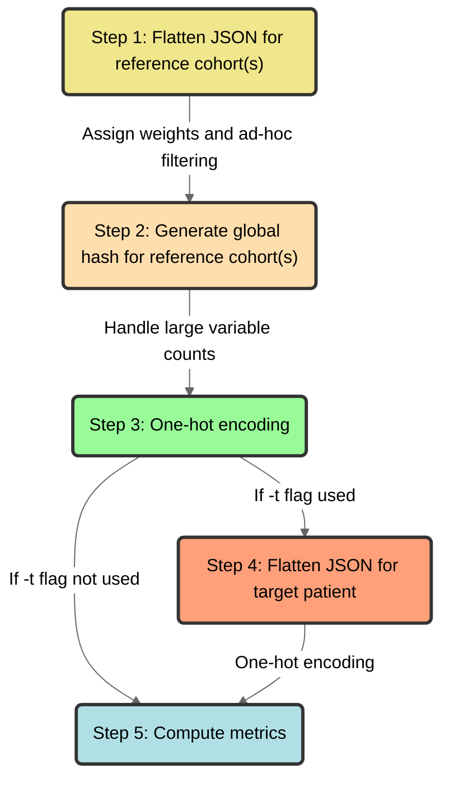

<!--
Generated from legacy MkDocs content.
Do not edit this file directly; edit docs/*.md and run:
  npm --prefix docs-site run prebuild
-->

# `Pheno-Ranker` algorithm



<figcaption>Schematic diagram of the Pheno-Ranker algorithm</figcaption>

## Step 1: Flatten JSON for reference cohort(s)

Each object containing one individual (loaded from [PXF](/pxf) or [BFF](/bff) files) for the reference cohort(s) is “flattened” into a one-dimensional hash data structure (i.e., associative array or lookup table) and the variables are initialized with weights of `1`. For terms that consist of arrays of objects (e.g., _phenotypicFeatures_), the element indices are replaced with the [CURIE](https://www.w3.org/TR/curie/)-style identifier (`"id"`) from the _required_ ontology class, instead of using the element index. We used an ad-hoc filtering (that can be changed with a configuration file) to filter out variables that do not provide any value to the similarity. For instance:

```json
"sex": {
        "id": "NCIT:C16576",
        "label": "female"
}
```

Becomes:

```json
“sex.id.NCIT:C16576” : 1
```

And an array:

```json
 "interventionsOrProcedures" : [
         {
            "bodySite" : {
               "id" : "NCIT:C12736",
               "label" : "intestine"
            },
            "procedureCode" : {
               "id" : "NCIT:C157823",
               "label" : "Colon Resection"
            }
         },
       {
            "bodySite" : {
               "id" : "NCIT:C12736",
               "label" : "intestine"
            },
            "procedureCode" : {
               "id" : "NCIT:C86074",
               "label" : "Hemicolectomy"
            }
         },
]

```

Becomes:
```json
"interventionsOrProcedures.NCIT:C157823.bodySite.id.NCIT:C12736" : 1,
"interventionsOrProcedures.NCIT:C157823.procedureCode.id.NCIT:C157823" : 1,

"interventionsOrProcedures.NCIT:C86074.bodySite.id.NCIT:C12736" : 1,
"interventionsOrProcedures.NCIT:C86074.procedureCode.id.NCIT:C86074" : 1,
```

Note that the flattened keys maintain the original hierarchical relationships of the data.

<details>
<summary>Nested arrays from v1.08</summary>

From v1.08 onward, arrays nested more than one level deep are **canonicalized automatically** before the global hash is generated. This means users do not need to transpose or manually rewrite nested arrays just to avoid differences caused only by **array order**.

**First-level arrays** use the identifiers defined in the configuration. **Deeper arrays** are handled automatically using the values that are actually used for comparison.

For example, these two categorical nested arrays are treated as equivalent:

```json
"diagnosticMarkers": [
  { "id": "NCIT:C131711", "status": "positive" },
  { "id": "NCIT:C140720", "status": "negative" }
]
```

```json
"diagnosticMarkers": [
  { "status": "negative", "id": "NCIT:C140720" },
  { "status": "positive", "id": "NCIT:C131711" }
]
```

Before generating the global hash, the nested array is converted to an object keyed by **stable content hashes**:

```json
"diagnosticMarkers": {
  "idx_8c3d5a4e2f10": { "id": "NCIT:C131711", "status": "positive" },
  "idx_b91a03c77e62": { "id": "NCIT:C140720", "status": "negative" }
}
```

In isolation, the nested array would flatten to variables that include the <code>{"idx_<hash>"}</code> identity:

```json
"diagnosticMarkers.idx_8c3d5a4e2f10.id.NCIT:C131711" : 1,
"diagnosticMarkers.idx_8c3d5a4e2f10.status.positive" : 1,
"diagnosticMarkers.idx_b91a03c77e62.id.NCIT:C140720" : 1,
"diagnosticMarkers.idx_b91a03c77e62.status.negative" : 1
```

In full BFF/PXF records, this nested path is usually below a first-level term, so the **final key also contains the first-level configured identifier**. For example, schematically:

```json
"medicalActions": [
  {
    "treatment": {
      "agent": { "id": "CHEBI:41879" },
      "responseMarkers": [
        {
          "id": "NCIT:C12345",
          "status": "improved",
          "evidence": [
            { "id": "ECO:0000314", "source": "manual-assertion" },
            { "id": "ECO:0000501", "source": "clinical-report" }
          ]
        }
      ]
    }
  }
]
```

After canonicalization and flattening, the first-level array uses its configured identifier (`CHEBI:41879`), while both deeper nested levels use their own <code>{"idx_<hash>"}</code> identities. The shortened hashes below are illustrative:

```json
"medicalActions.CHEBI:41879.treatment.responseMarkers.idx_8c3d5a4e2f10.id.NCIT:C12345" : 1,
"medicalActions.CHEBI:41879.treatment.responseMarkers.idx_8c3d5a4e2f10.status.improved" : 1,
"medicalActions.CHEBI:41879.treatment.responseMarkers.idx_8c3d5a4e2f10.evidence.idx_6d32a9bb1421.id.ECO:0000314" : 1,
"medicalActions.CHEBI:41879.treatment.responseMarkers.idx_8c3d5a4e2f10.evidence.idx_6d32a9bb1421.source.manual-assertion" : 1,
"medicalActions.CHEBI:41879.treatment.responseMarkers.idx_8c3d5a4e2f10.evidence.idx_e4512cf09aa8.id.ECO:0000501" : 1,
"medicalActions.CHEBI:41879.treatment.responseMarkers.idx_8c3d5a4e2f10.evidence.idx_e4512cf09aa8.source.clinical-report" : 1
```

Programmatically, `Pheno-Ranker` treats **each nested array element separately**. For each element, it flattens the element, keeps only the **key/value pairs used for comparison**, sorts those key/value pairs, joins them into one canonical string, and computes a **SHA-1 digest**. Here, SHA-1 is used only as a deterministic, non-cryptographic content fingerprint. Sorting is why `{ "id": "...", "status": "..." }` and `{ "status": "...", "id": "..." }` produce the same <code>{"idx_<hash>"}</code>. The key for that element is the first 12 hexadecimal characters of the digest prefixed with `idx_`. Therefore, the **same categorical element gets the same key** even if the array order is different.

</details>
## Step 2: Generate global hash for reference cohort(s)

We generate a global hash for the reference cohort(s) by utilizing the unique variable entries. The size of the hash depends on the number of variables present in the cohort. The algorithm is optimized to handle a large number of variables, even exceeding 100K (e.g., when considering genomic variation data such as SNPs). To address any potential limitations, the algorithm allows selecting a random subset of N variables from the total available with `--max-number-vars`.

```json
{
"interventionsOrProcedures.NCIT:C157823.bodySite.id.NCIT:C12736" : 1,
"interventionsOrProcedures.NCIT:C157823.procedureCode.id.NCIT:C157823" : 1,
"interventionsOrProcedures.NCIT:C86074.bodySite.id.NCIT:C12736" : 1,
"interventionsOrProcedures.NCIT:C86074.procedureCode.id.NCIT:C86074" : 1,
}
```

## Step 3: One-hot encoding

We use the global hash to convert categorical data into numerical form through one-hot encoding. For each individual in the reference cohort(s), we create a binary string (also referred in the text as “binary vector” or simply as “vector”) reflecting the variables in the global hash. The characters within this vector coincide with the global hash's sorted keys, marking a `1` for each variable present in an individual's data and a `0` for absent variables. The length of the vector corresponds to the number of keys in the global hash, ensuring a uniform representation of each individual's data in line with the global hash's size.

```json
{
"id_1" : "11...n",
"id_2" : "01...n"
}
```

## Step 4: Flatten JSON for target patient

When working with a target patient's data from a JSON file, it is flattened using the same method as described in step one. We then calculate the patient's binary vector using the global hash derived from the cohort, omitting any variables unique to the patient. This approach of excluding patient-specific variables makes it easier to search within unrelated databases that contain pre-computed data.

## Step 5: Compute metrics

Compute different metrics depending on _cohort_ or _target_ mode.
