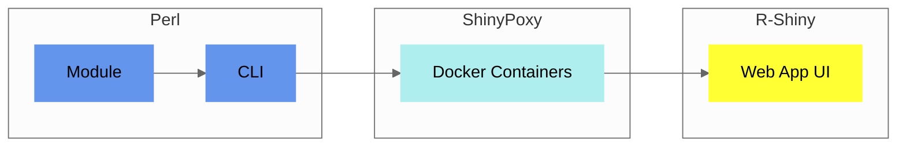

<!--
Generated from legacy MkDocs content.
Do not edit this file directly; edit docs/*.md and run:
  npm --prefix docs-site run prebuild
-->

## Components

The core of `Pheno-Ranker` is a [Perl module](https://metacpan.org/pod/Pheno%3A%3ARanker), accessible through a [command-line interface](/usage#synopsis).

A [Web App UI](https://pheno-ranker.cnag.eu) enhances its functionality, built with [R-Shiny](https://shiny.posit.co).

<figcaption>Diagram showing Pheno-Ranker implementation</figcaption>

:::tip[Which one should I use?]
- **For a quick and practical start**, try the [`Pheno-Ranker` Web App UI](https://pheno-ranker.cnag.eu). It's an intuitive, browser-based interface for straightforward usage.
- **For advanced features**, explore the [Command-Line Interface (CLI)](/usage), which offers greater control and flexibility.
:::
## Utilities

`Pheno-Ranker` includes several companion command-line utilities:

1. [bff-pxf-plot](/./bff-pxf-plot): a CLI tool to create summary statistics for BFF/PXF data.
2. [bff-pxf-simulator](/./bff-pxf-simulator): a CLI tool to simulate BFF/PXF data.
3. [csv2pheno-ranker](/./csv-import): a CLI tool to convert `CSV` into `Pheno-Ranker` input files.
4. [QR encoder/decoder](/./qr-code-generator): CLI tools to transform data back and forth into QR codes and `PDF` reports.
