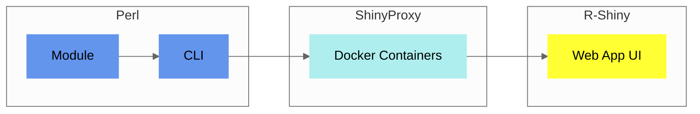

## Components

The core of `Pheno-Ranker` is a [Perl module](https://metacpan.org/pod/Pheno%3A%3ARanker), accessible through a [command-line interface](/usage#synopsis).

The R-Shiny [Web App UI](https://cnag-biomedical-informatics.github.io/pheno-ranker-ui/) is legacy. From v1.09, the Desktop App replaces it as the graphical interface. The CLI remains available independently, including through CPAN.

```mermaid
%%{init: {'theme':'neutral'}}%%
graph LR
  subgraph "Perl"
  A[Module]--> B[CLI]
  end

  subgraph "ShinyProxy"
  B --> C[Docker Containers]
  end

  subgraph "R-Shiny"
  C --> D[Web App UI]
  end

  style A fill: #6495ED, stroke: #6495ED
  style B fill: #6495ED, stroke: #6495ED
  style C fill: #AFEEEE, stroke: #AFEEEE
  style D fill: #FFFF33, stroke: #FFFF33
```

<figcaption>Legacy Web App UI architecture</figcaption>

:::tip[Which interface should I use?]
The Desktop App provides a local graphical interface from v1.09. Use the [Command-Line Interface (CLI)](/usage) for terminal and scripted workflows. The legacy Web App UI is no longer the interface for new workflows.
:::
## Utilities

`Pheno-Ranker` includes several companion command-line utilities:

1. [bff-pxf-plot](/bff-pxf-plot): a CLI tool to create summary statistics for BFF/PXF data.
2. [bff-pxf-simulator](/bff-pxf-simulator): a CLI tool to simulate BFF/PXF data.
3. [csv2pheno-ranker](/csv-import): a CLI tool to convert `CSV` into `Pheno-Ranker` input files.
4. [QR encoder/decoder](/qr-code-generator): CLI tools to transform data back and forth into QR codes and `PDF` reports.
