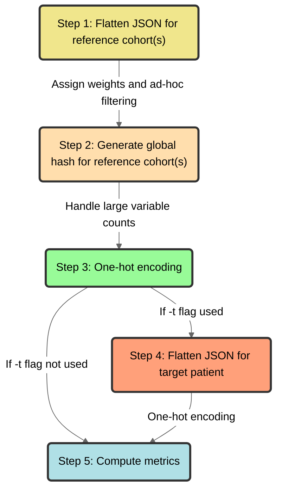

# `Pheno-Ranker` algorithm



<figcaption>Schematic diagram of the Pheno-Ranker algorithm</figcaption>

## Step 1: Flatten JSON for reference cohort(s)

Each object containing one individual (loaded from [PXF](pxf.md) or [BFF](bff.md) files) for the reference cohort(s) is “flattened” into a one-dimensional hash data structure (i.e., associative array or lookup table) and the variables are initialized with weights of `1`. For terms that consist of arrays of objects (e.g., _phenotypicFeatures_), the element indices are replaced with the [CURIE](https://www.w3.org/TR/curie/)-style identifier (`"id"`) from the _requires_ ontology class, instead of using the element index. We used an ad-hoc filtering (that can be changed with a configuration file) to remove variables that do not provide any value to the similarity. For instance:

```json
"sex": {
        "id": "NCIT:C16576",
        "label": "female"
}
```

Becomes:

```json
“sex.id.NCIT:C16576” : 1
```

And an array:

```json
 "interventionsOrProcedures" : [
         {
            "bodySite" : {
               "id" : "NCIT:C12736",
               "label" : "intestine"
            },
            "procedureCode" : {
               "id" : "NCIT:C157823",
               "label" : "Colon Resection"
            }
         },
       {
            "bodySite" : {
               "id" : "NCIT:C12736",
               "label" : "intestine"
            },
            "procedureCode" : {
               "id" : "NCIT:C86074",
               "label" : "Hemicolectomy"
            }
         },
]

```

Becomes:
```json
"interventionsOrProcedures.NCIT:C157823.bodySite.id.NCIT:C12736" : 1,
"interventionsOrProcedures.NCIT:C157823.procedureCode.id.NCIT:C157823" : 1,

"interventionsOrProcedures.NCIT:C86074.bodySite.id.NCIT:C12736" : 1,
"interventionsOrProcedures.NCIT:C86074.procedureCode.id.NCIT:C86074" : 1,
```

Note that the flattened keys maintain the original hierarchical relationships of the data.

## Step 2: Generate global hash for reference cohort(s)

We generate a global hash (i.e., lookup table) for the reference cohort(s) by utilizing the unique variable entries. The size of the hash depends on the number of variables present in the cohort. The algorithm is optimized to handle a large number of variables, even exceeding 100K (e.g., when considering genomic variation data such as SNPs). To address any potential limitations, the algorithm allows selecting a randomly subset of N random variables from the total available (with the flag `--max-number-var`).

```json
{
"interventionsOrProcedures.NCIT:C157823.bodySite.id.NCIT:C12736" : 1,
"interventionsOrProcedures.NCIT:C157823.procedureCode.id.NCIT:C157823" : 1,
"interventionsOrProcedures.NCIT:C86074.bodySite.id.NCIT:C12736" : 1,
"interventionsOrProcedures.NCIT:C86074.procedureCode.id.NCIT:C86074" : 1,
}
```

## Step 3: One-hot encoding

We use this global hash to represent categorical data in a numerical format via one-hot encoding. Thus, a binary digit string (or vector) that represents each individual in the reference cohort(s). If the variable exists in an individual, they will be assigned a value of `1`, and `0` otherwise. Each vector has a length equal to the vocabulary size and a value of `1` in the position corresponding to the index of the word in the vocabulary and `0`s elsewhere. This way, each individual will have a binary digit string that is as long as the global hash. 

```json
{
"id_1" : "11...n",
"id_2" : "01...n"
}
```

## Step 4: Flatten JSON for target patient

If we are working with a target patient, the JSON file is flattened using the same procedure as in step one. Subsequently, the binary digit for the patient is calculated based on the global hash, excluding any patient-specific variables.

## Step 5: Compute metrics

Compute differents metrics depending on reference or target mode.
