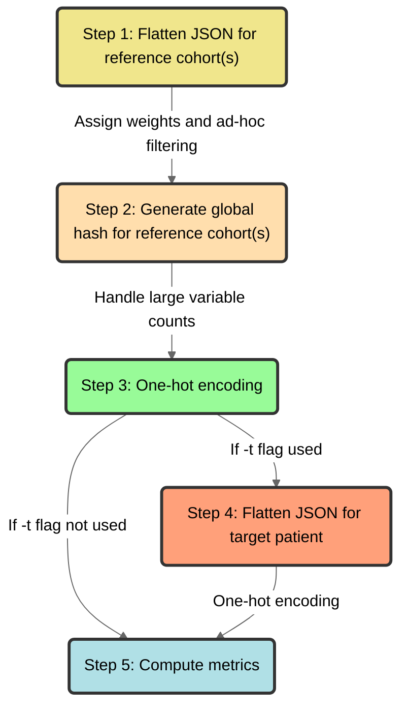

# `Pheno-Ranker` algorithm



<figcaption>Schematic diagram of the Pheno-Ranker algorithm</figcaption>

## Step 1: Flatten JSON for reference cohort(s)

Each object containing one individual (loaded from [PXF](pxf.md) or [BFF](bff.md) files) for the reference cohort(s) is “flattened” into a one-dimensional hash data structure (i.e., associative array or lookup table) and the variables are initialized with weights of `1`. For terms that consist of arrays of objects (e.g., _phenotypicFeatures_), the element indices are replaced with the [CURIE](https://www.w3.org/TR/curie/)-style identifier (`"id"`) from the _required_ ontology class, instead of using the element index. We used an ad-hoc filtering (that can be changed with a configuration file) to filter out variables that do not provide any value to the similarity. For instance:

```json
"sex": {
        "id": "NCIT:C16576",
        "label": "female"
}
```

Becomes:

```json
“sex.id.NCIT:C16576” : 1
```

And an array:

```json
 "interventionsOrProcedures" : [
         {
            "bodySite" : {
               "id" : "NCIT:C12736",
               "label" : "intestine"
            },
            "procedureCode" : {
               "id" : "NCIT:C157823",
               "label" : "Colon Resection"
            }
         },
       {
            "bodySite" : {
               "id" : "NCIT:C12736",
               "label" : "intestine"
            },
            "procedureCode" : {
               "id" : "NCIT:C86074",
               "label" : "Hemicolectomy"
            }
         },
]

```

Becomes:
```json
"interventionsOrProcedures.NCIT:C157823.bodySite.id.NCIT:C12736" : 1,
"interventionsOrProcedures.NCIT:C157823.procedureCode.id.NCIT:C157823" : 1,

"interventionsOrProcedures.NCIT:C86074.bodySite.id.NCIT:C12736" : 1,
"interventionsOrProcedures.NCIT:C86074.procedureCode.id.NCIT:C86074" : 1,
```

Note that the flattened keys maintain the original hierarchical relationships of the data.

## Step 2: Generate global hash for reference cohort(s)

We generate a global hash for the reference cohort(s) by utilizing the unique variable entries. The size of the hash depends on the number of variables present in the cohort. The algorithm is optimized to handle a large number of variables, even exceeding 100K (e.g., when considering genomic variation data such as SNPs). To address any potential limitations, the algorithm allows selecting a randomly subset of N random variables from the total available (with the flag `--max-number-var`).

```json
{
"interventionsOrProcedures.NCIT:C157823.bodySite.id.NCIT:C12736" : 1,
"interventionsOrProcedures.NCIT:C157823.procedureCode.id.NCIT:C157823" : 1,
"interventionsOrProcedures.NCIT:C86074.bodySite.id.NCIT:C12736" : 1,
"interventionsOrProcedures.NCIT:C86074.procedureCode.id.NCIT:C86074" : 1,
}
```

## Step 3: One-hot encoding

We use the global hash to convert categorical data into numerical form through one-hot encoding. For each individual in the reference cohort(s), we create a binary string (also referred in the text as “binary vector” or simply as “vector”) reflecting the variables in the global hash. The characters within this vector coincide with the global hash's sorted keys, marking a `1` for each variable present in an individual's data and a `0` for absent variables. The length of the vector corresponds to the number of keys in the global hash, ensuring a uniform representation of each individual's data in line with the global hash's size.

```json
{
"id_1" : "11...n",
"id_2" : "01...n"
}
```

## Step 4: Flatten JSON for target patient

When working with a target patient's data from a JSON file, it is flattened using the same method as described in step one. We then calculate the patient's binary vector using the global hash derived from the cohort, omitting any variables unique to the patient. This approach of excluding patient-specific variables makes it easier to search within unrelated databases that contain pre-computed data.

## Step 5: Compute metrics

Compute differents metrics depending on _cohort_ or _target_ mode.
