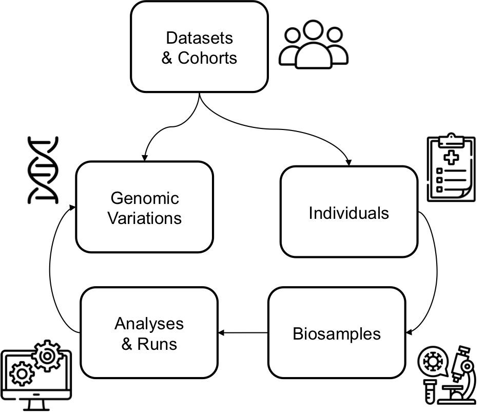

**BFF** stands for **B**eacon **F**riendly **F**ormat. The [BFF](https://b2ri-documentation.readthedocs.io/en/latest/data-ingestion) is a data exchange format composed of 7 `JSON` files. These files correspond to the 7 entities of the [Beacon v2 Models](https://docs.genomebeacons.org/models).

<figure markdown>
   { width="400" }
   <figcaption> Entities in Beacon v2 Models</figcaption>
</figure>

!!! Abstract "About Beacon v2 Models' entities"
    Of the seven entities (a.k.a., entry types) in the Beacon v2 Models, [individuals](https://docs.genomebeacons.org/schemas-md/individuals_defaultSchema) is typically the only one that contains phenotypic data. 

As an input, `Convert-Pheno` accepts data from the [individuals](https://docs.genomebeacons.org/schemas-md/individuals_defaultSchema) entity, serialized in [BFF](https://b2ri-documentation.readthedocs.io/en/latest/data-ingestion) format (`individuals.json`).


??? Tip "Browsing BFF `JSON` data"
    You can browse a public BFF v2 file with the following **JSON viewers**:

    * [JSON Hero](https://jsonhero.io/new?url=https://raw.githubusercontent.com/cnag-biomedical-informatics/pheno-ranker/main/t/individuals.json)
    * [Datasette](https://lite.datasette.io/?json=https%3A%2F%2Fraw.githubusercontent.com%2Fcnag-biomedical-informatics%2Fpheno-ranker%2Fmain%2Ft%2Findividuals.json#/data?sql=select+*+from+individuals)

## BFF (individuals) as input { width="20" }

When using the `pheno-ranker` command-line interface, simply ensure the [correct syntax](https://github.com/cnag-biomedical-informatics/pheno-ranker#synopsis) is provided.


=== "Cohort mode"

    Basic run:

    ```bash
    pheno-ranker -r individuals.json
    ```

    The default output is named `matrix.txt` and it's a `N x N` bidimensional matrix with a pairwise comparison of all individuals.

=== "Patient mode"

    Basic run:

    ```bash
    pheno-ranker -r individuals.json -t patient.json
    ```

    The output will be printed to `STDOUT` and to a file named `rank.txt`. The matching individuals will be sorted according to their [Hamming distance](https://en.wikipedia.org/wiki/Hamming_distance) to the reference patient. See aditional details in the [Patient Mode](patient.md) page.
