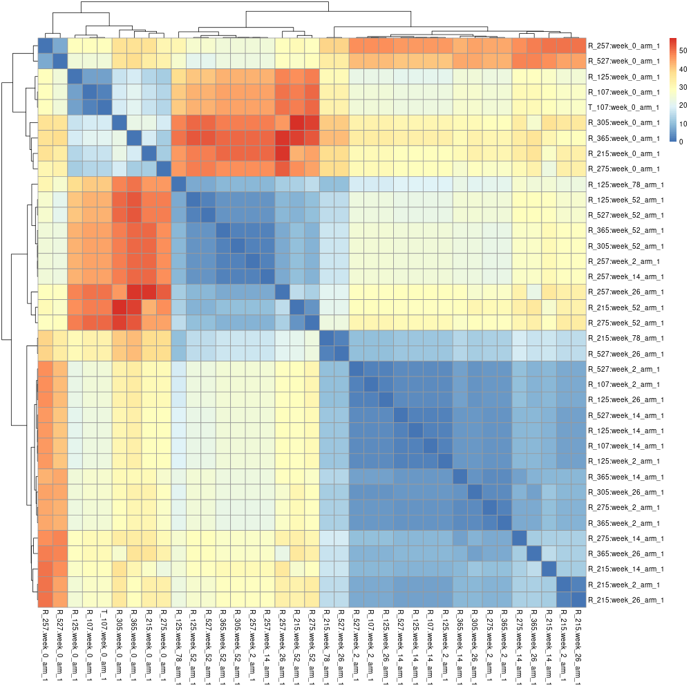
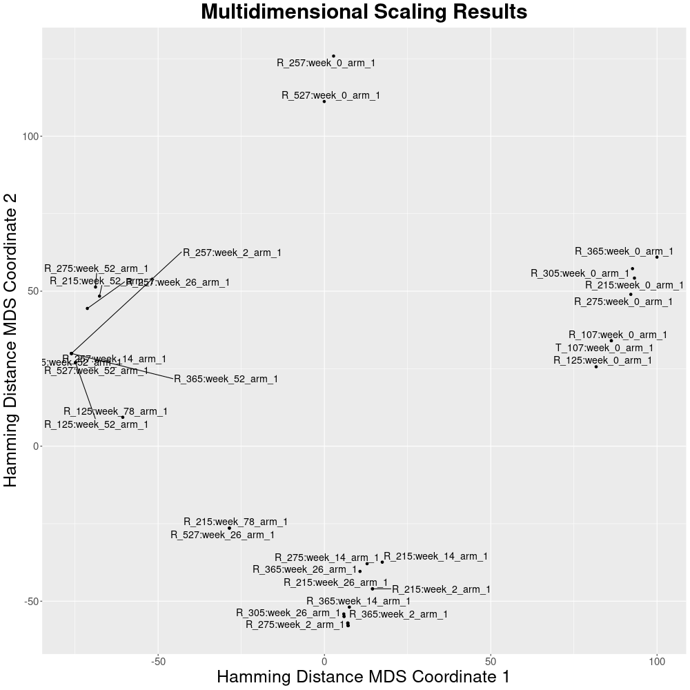
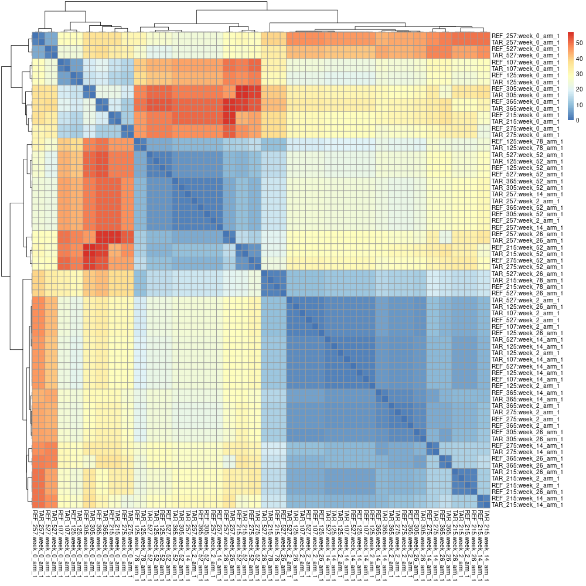

_Cohort mode_ performs a **cross-comparison** of all individuals in a cohort(s) using as a metric the [Hamming distance](https://en.wikipedia.org/wiki/Hamming_distance) or the [Jaccard index](https://en.wikipedia.org/wiki/Jaccard_index). The resulting matrix can be further analyzed (e.g., with `R`) for cluster characterization or processed through dimensionality reduction.

## Usage

When using the `Pheno-ranker` command-line interface, simply ensure the [correct syntax](https://github.com/cnag-biomedical-informatics/pheno-ranker#synopsis) is provided.

=== "Intra-cohort"

    For this example, we'll use [`individuals.json`](https://github.com/CNAG-Biomedical-Informatics/pheno-ranker/blob/main/t/individuals.json), which contains a `JSON` array of 36 patients. We will conduct a comprehensive cross-comparison among all individuals within this file.

    ```bash
    ./pheno-ranker -r individuals.json 

    ```

    This process generates a `matrix.txt` file, containing the results of 36 x 36 pairwise comparisons, calculated using the [Hamming distance](https://en.wikipedia.org/wiki/Hamming_distance) metric.

    ??? Tip "Defining the similarity metric"
        Use the flag `--similarity-metric-cohort`. The default valie is `hamming`. The alternative value is `jaccard`.

    ??? Tip "Exporting intermediate files"
        It is possible to export all intermediate files, as well as a file indicating coverage with the flag `--e`.
        Examples:

        ```bash
        ./pheno-ranker -r individuals.json --e 
        ./pheno-ranker -r individuals.json --e my_fav_id # for chosing a prefix
        ```

        The intermediate files can be used for further processing (e.g., import to a database; see [FAQs](faq.md)) or to make **informed decisions**. For instance, the file `export.coverage_stats.json` has stats on the coverage of each term (1D-key) in the cohort. It is possible to go more granular with a tool like `jq` that parses `JSON`. For instance:


        ```bash
        jq -r 'to_entries | map(.key + ": " + (.value | length | tostring))[]' < export.ref_hash.json
        ```

        This command will print how many variables per individual were actually used to perform the comparison. You can post-process the output to check for unbalanced data.

    --8<-- "tbl/matrix.md"

     The matrix can be processed to obtain a heatmap:

    ??? Example "R code"
        ```R
        # Load library
        library("pheatmap")
    
        # Read in the input file as a matrix
        data <- as.matrix(read.table("matrix.txt", header = TRUE, row.names = 1))
    
        # Save image
        png(filename = "heatmap.png", width = 1000, height = 1000,
            units = "px", pointsize = 12, bg = "white", res = NA)
    
        # Create the heatmap with row and column labels
        pheatmap(data)
        ```
    
    <figure markdown>
      { width="800" }
      <figcaption> Heatmap of a intra-cohort pairwise comparison</figcaption>
    </figure>


    The same matrix can be processed with multidimensional scaling to reduce the dimensionality

    ??? Example "R code"

        ```R
        library(ggplot2)
        library(ggrepel)
        
        # Read in the input file as a matrix 
        data <- as.matrix(read.table("matrix.txt", header = TRUE, row.names = 1))
        
        #perform multidimensional scaling
        fit <- cmdscale(data, eig=TRUE, k=2)
        
        #extract (x, y) coordinates of multidimensional scaling
        x <- fit$points[,1]
        y <- fit$points[,2]
        
        # Create example data frame
        df <- data.frame(x, y, label=row.names(data))
        
        # Save image
        png(filename = "mds.png", width = 1000, height = 1000,
            units = "px", pointsize = 12, bg = "white", res = NA)
        
        # Create scatter plot
        ggplot(df, aes(x, y, label = label)) +
          geom_point() +
          geom_text_repel(size = 5, # Adjust the size of the text
                          box.padding = 0.2, # Adjust the padding around the text
                          max.overlaps = 10) + # Change the maximum number of overlaps
          labs(title = "Multidimensional Scaling Results",
               x = "Hamming Distance MDS Coordinate 1",
               y = "Hamming Distance MDS Coordinate 2") + # Add title and axis labels
          theme(
                plot.title = element_text(size = 30, face = "bold", hjust = 0.5),
                axis.title = element_text(size = 25),
                axis.text = element_text(size = 15))
        ```

    <figure markdown>
       { width="800" }
       <figcaption> Multidimensional scaling of a intra-cohort pairwise comparison</figcaption>
    </figure>


=== "Inter-cohort"

     We'll be using `individuals.json` again, which includes data for 36 patients. This time, however, we'll use it twice to simulate having two cohorts. The software will add a `CX_` prefix to the `primary_key` values to help us keep track of which patient comes from which usage of the file.

    ```bash
    ./pheno-ranker -r individuals.json individuals.json

    ```

    !!! Question "Is it possible to have a cohort with just one individual?"
        Absolutely, a cohort can indeed be composed of a single individual. This allows for an analysis involving both a cohort and specific patient(s) simultaneously.

    <figure markdown>
       { width="800" }
       <figcaption> Heatmap of a inter-cohort pairwise comparison</figcaption>
    </figure>


    The prefixes can be changed with the flag `--append-prefixes`:

    ```bash
    ./pheno-ranker -r individuals.json individuals.json --append-prefixes REF TAR

    ```
    This will create a `matrix.txt` file of (36+36) x (36+36) cells. Again, this matrix can be processed with R:

    <figure markdown>
       { width="800" }
       <figcaption> Heatmap of a inter-cohort pairwise comparison</figcaption>
    </figure>

