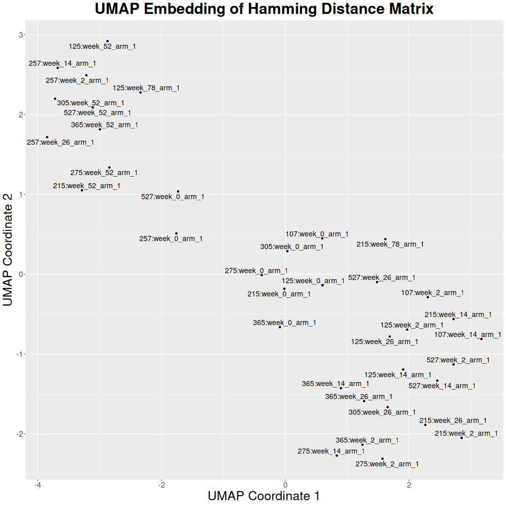

_Cohort mode_ performs a **cross-comparison** of all individuals in a cohort(s) using as a metric the [Hamming distance](https://en.wikipedia.org/wiki/Hamming_distance) or the [Jaccard index](https://en.wikipedia.org/wiki/Jaccard_index). The resulting matrix can be further analyzed (e.g., with `R`) using unsupervised learning techniques such as cluster characterization, dimensionality reduction, or graph-based analytics.

???+ Example "Generic JSON tutorial"
    We created a [tutorial](generic-json.md) that deliberately uses generic JSON data (i.e., movies) to illustrate the capabilities of `Pheno-Ranker`, as starting with familiar examples can help you better grasp its usage.

    Once you are comfortable with the concepts using movie data, you will find it easier to apply `Pheno-Ranker` to real GA4GH standards. For specific examples, please refer to the [cohort](cohort.md) and [patient](patient.md) pages in this documentation.

## Usage

When using the `Pheno-ranker` command-line interface, simply ensure the [correct syntax](https://github.com/cnag-biomedical-informatics/pheno-ranker#synopsis) is provided.

=== "Intra-cohort"

    For this example, we'll use [`individuals.json`](https://github.com/CNAG-Biomedical-Informatics/pheno-ranker/blob/main/t/individuals.json), which contains a `JSON` array of 36 patients. We will conduct a comprehensive cross-comparison among all individuals within this file.

    First, we will download the file:
    ```bash
    wget https://raw.githubusercontent.com/CNAG-Biomedical-Informatics/pheno-ranker/refs/heads/main/t/individuals.json
    ```
    And now we run `Pheno-Ranker`:
    
    ```bash
    pheno-ranker -r individuals.json 

    ```

    ??? Example "More input examples"
       
         You can find more input examples [here](https://github.com/CNAG-Biomedical-Informatics/pheno-ranker/tree/main/share/ex).

    This process generates a `matrix.txt` file, containing the results of 36 x 36 pairwise comparisons, calculated using the [Hamming distance](https://en.wikipedia.org/wiki/Hamming_distance) metric.

    ??? Example "See `matrix.txt`"
        --8<-- "tbl/matrix.md"

    ??? Tip "Defining the similarity metric"
        Use the flag `--similarity-metric-cohort`. The default value is `hamming`. The alternative value is `jaccard`.

    ??? Tip "Exporting intermediate files"
        It is possible to export all intermediate files, as well as a file indicating coverage with the flag `--e`.
        Examples:

        ```bash
        pheno-ranker -r individuals.json --e 
        pheno-ranker -r individuals.json --e my_fav_id # for chosing a prefix
        ```

        The intermediate files can be used for further processing (e.g., import to a database; see [FAQs](faq.md)) or to make **informed decisions**. For instance, the file `export.coverage_stats.json` has stats on the coverage of each term (1D-key) in the cohort. It is possible to go more granular with a tool like `jq` that parses `JSON`. For instance:


        ```bash
        jq -r 'to_entries | map(.key + ": " + (.value | length | tostring))[]' < export.ref_hash.json
        ```

        This command will print how many variables per individual were actually used to perform the comparison. You can post-process the output to check for unbalanced data.

    ??? Example "Included R scripts"

        You can find in the link below a few examples to perform clustering and multimensional scaling with your data:

        [R scripts at GitHub](https://github.com/CNAG-Biomedical-Informatics/pheno-ranker/tree/main/share/r).

    ### Clustering

    The matrix can be processed to obtain a heatmap:

    ??? Example "R code"

        ```R
        --8<-- "https://raw.githubusercontent.com/CNAG-Biomedical-Informatics/pheno-ranker/main/share/r/heatmap.R"
        ```
    
    <figure markdown>
      { width="800" }
      <figcaption>Heatmap of a intra-cohort pairwise comparison</figcaption>
    </figure>


    ### Dimensionality reduction

    The same matrix can be processed with multidimensional scaling to reduce the dimensionality.

    ??? Example "R code"

        ```R
        --8<-- "https://raw.githubusercontent.com/CNAG-Biomedical-Informatics/pheno-ranker/main/share/r/mds.R"
        ```

    <figure markdown>
       { width="800" }
       <figcaption>Multidimensional scaling of a intra-cohort pairwise comparison</figcaption>
    </figure>

    Or the dimensionality can be reduced with UMAP:

    ??? Example "R code"

        ```R
        --8<-- "https://raw.githubusercontent.com/CNAG-Biomedical-Informatics/pheno-ranker/main/share/r/umap.R"
        ```

    <figure markdown>
       { width="800" }
       <figcaption>UMAP of a intra-cohort pairwise comparison</figcaption>
    </figure>


    ### Graph analytics

    `Pheno-Ranker`has an option for creating a graph in `JSON`format, compatible with [Cytoscape](https://cytoscape.org/) ecoystem.

    ??? Example "Bash code for Cytoscape-compatible graph/network"

        ```bash
        pheno-ranker -r individuals.json --cytoscape-json
        ```
        This command generates a `graph.json` file, as well as a `matrix.txt` file.

        To produce summary statistics, use:

        ```bash
        pheno-ranker -r individuals.json --cytoscape-json --graph-stats
        ```
        This command will produce a file called `graph_stats.txt`. For additional information, see the [generic JSON tutorial](generic-json.md).

=== "Inter-cohort"

     We'll be using `individuals.json` again, which includes data for 36 patients. This time, however, we'll use it twice to simulate having two cohorts. The software will add a `CX_` prefix to the `primary_key` values to help us keep track of which patient comes from which usage of the file.

    ```bash
    pheno-ranker -r individuals.json individuals.json

    ```

    !!! Question "Is it possible to have a cohort with just one individual?"
        Absolutely, a cohort can indeed be composed of a single individual. This allows for an analysis involving both a cohort and specific patient(s) simultaneously.

    <figure markdown>
       { width="800" }
       <figcaption>Heatmap of a inter-cohort pairwise comparison</figcaption>
    </figure>


    The prefixes can be changed with the flag `--append-prefixes`:

    ```bash
    pheno-ranker -r individuals.json individuals.json --append-prefixes REF TAR

    ```
    This will create a `matrix.txt` file of (36+36) x (36+36) cells. Again, this matrix can be processed with R:

    <figure markdown>
       { width="800" }
       <figcaption>Heatmap of a inter-cohort pairwise comparison</figcaption>
    </figure>

