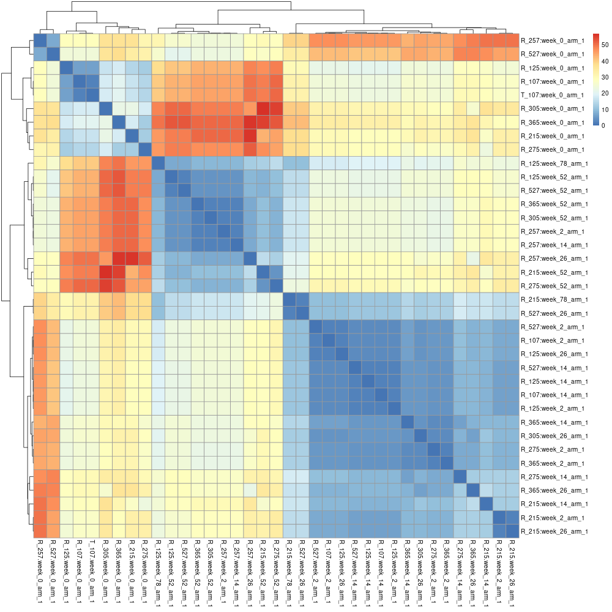
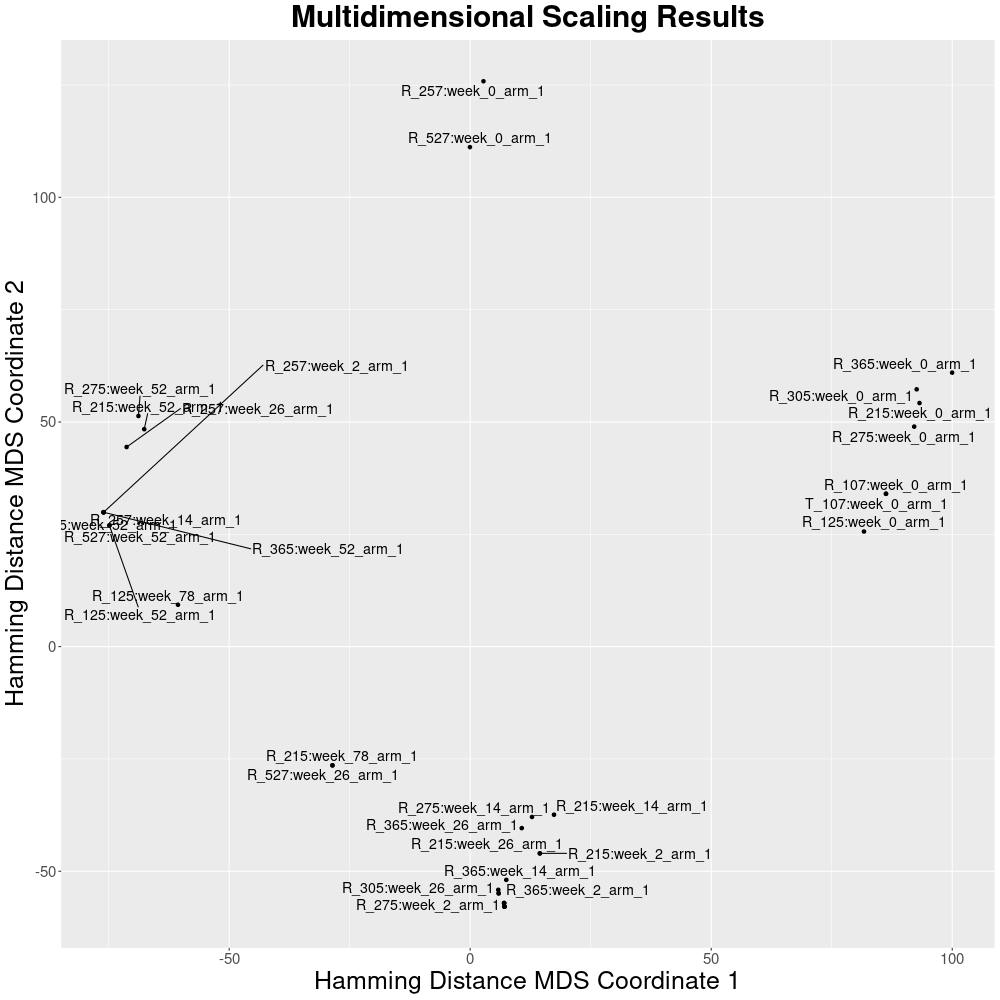
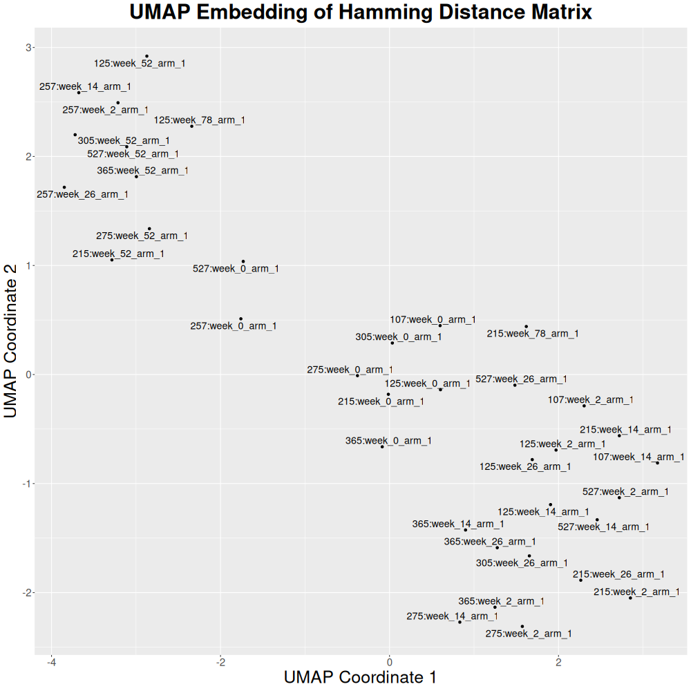
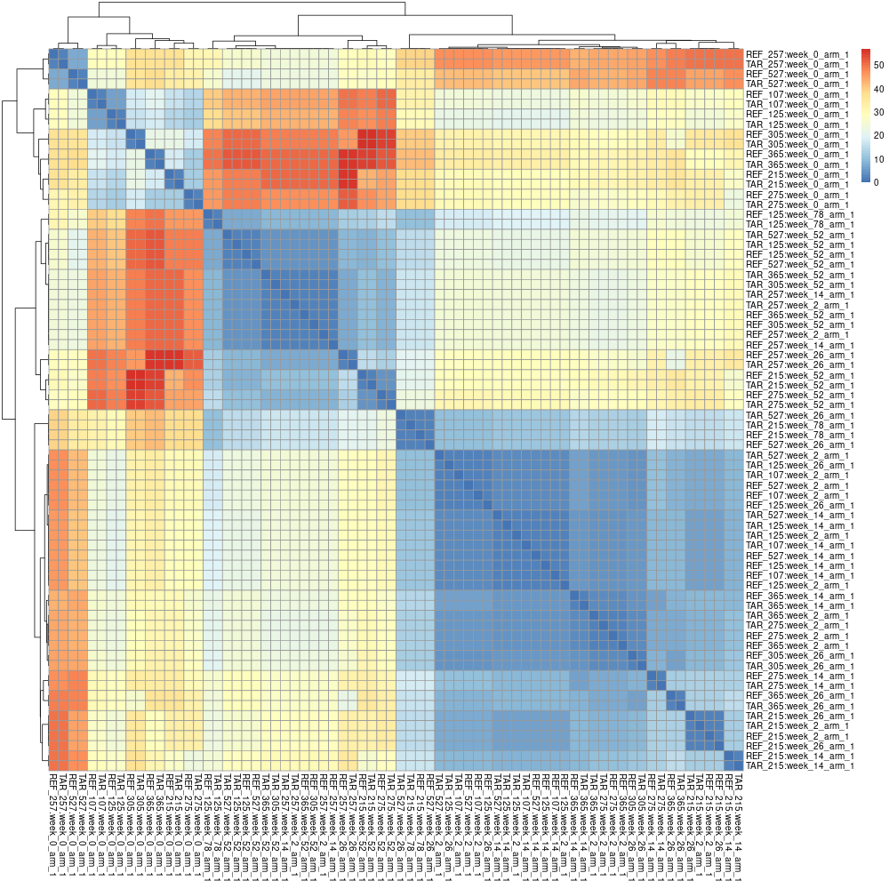

# Cohort Mode

_Cohort mode_ performs an all-vs-all comparison of records in one or more cohorts. Each record is flattened, encoded as a binary vector, and compared with either [Hamming distance](https://en.wikipedia.org/wiki/Hamming_distance) or the [Jaccard index](https://en.wikipedia.org/wiki/Jaccard_index).

Use cohort mode when you want to explore the structure of a cohort, compare multiple cohorts, identify clusters, run dimensionality reduction, or export a graph for network analysis.

## What You Get

- `matrix.txt`: the default dense pairwise comparison matrix.
- `graph.json`: an optional Cytoscape-compatible graph when `--cytoscape-json` is used.
- `graph_stats.txt`: optional graph summary statistics when `--graph-stats` is used.
- `export.*.json`: optional intermediate hashes, vectors, and coverage statistics when `--export` is used.
- `matrix.mtx`: optional sparse Matrix Market output for large matrix workflows.

[See common usage](usage.md){ .md-button .md-button--primary }
[Read generic JSON tutorial](generic-json.md){ .md-button }
[Check installation](download-and-installation.md){ .md-button }

???+ Example "Generic JSON tutorial"
    We created a [tutorial](generic-json.md) that deliberately uses generic JSON data (i.e., movies) to illustrate the capabilities of `Pheno-Ranker`, as starting with familiar examples can help you better grasp its usage.

    Once you are comfortable with the concepts using movie data, you will find it easier to apply `Pheno-Ranker` to real GA4GH standards. For specific examples, please refer to the [cohort](cohort.md) and [patient](patient.md) pages in this documentation.

## Usage

The examples below show common cohort-mode command-line patterns. For the complete CLI reference, see [Usage](usage.md).

=== "Intra-cohort"

    For this example, we use [`individuals.json`](https://github.com/CNAG-Biomedical-Informatics/pheno-ranker/blob/main/t/data/individuals.json), a `JSON` array with 36 patients. The goal is to compare every patient against every other patient in the file.

    First, we will download the file:

    ```bash
    wget https://raw.githubusercontent.com/CNAG-Biomedical-Informatics/pheno-ranker/refs/heads/main/t/data/individuals.json
    ```

    Now run `Pheno-Ranker`:
    
    ```bash
    pheno-ranker -r individuals.json
    ```

    ??? Example "More input examples"
       
         You can find more input examples [here](https://github.com/CNAG-Biomedical-Informatics/pheno-ranker/tree/main/share/ex).

    This process generates a `matrix.txt` file, containing the results of 36 x 36 pairwise comparisons, calculated using the [Hamming distance](https://en.wikipedia.org/wiki/Hamming_distance) metric.

    ??? Example "See `matrix.txt`"
        --8<-- "tbl/matrix.md"

    ??? Tip "Defining the similarity metric"
        Use `--similarity-metric-cohort` to choose the cohort metric. The default value is `hamming`; the alternative is `jaccard`.

        ```bash
        pheno-ranker -r individuals.json --similarity-metric-cohort jaccard
        ```

    ??? Tip "Sparse Matrix Market output"
        By default, cohort mode writes a dense tab-separated matrix (`matrix.txt`). For large cohorts, you can instead write a sparse [Matrix Market](https://math.nist.gov/MatrixMarket/formats.html) coordinate file:

        ```bash
        pheno-ranker -r individuals.json --matrix-format mtx -o matrix.mtx
        ```

        The `mtx` format stores one triangle of the symmetric matrix and writes only non-zero values. It is always RAM-light and does not use the dense in-memory matrix cache controlled by `--max-matrix-records-in-ram`.

        The Matrix Market file includes comment lines mapping 1-based matrix indexes back to individual IDs:

        ```text
        % id 1 107:week_0_arm_1
        % id 2 107:week_2_arm_1
        ```

        Matrix output and Cytoscape graph output are generated independently. This means `--matrix-format mtx` can be combined with `--cytoscape-json`.

    ??? Tip "Exporting intermediate files"
        It is possible to export all intermediate files, as well as a file indicating coverage, with `--export` (`--e`).
        Examples:

        ```bash
        pheno-ranker -r individuals.json --export
        pheno-ranker -r individuals.json --export my_fav_id # choose a prefix
        ```

        The intermediate files can be used for further processing (e.g., import to a database; see [FAQs](faq.md)) or to make **informed decisions**. For instance, the file `export.coverage_stats.json` has stats on the coverage of each term (1D-key) in the cohort. It is possible to go more granular with a tool like `jq` that parses `JSON`. For instance:


        ```bash
        jq -r 'to_entries | map(.key + ": " + (.value | length | tostring))[]' < export.ref_hash.json
        ```

        This command will print how many variables per individual were actually used to perform the comparison. You can post-process the output to check for unbalanced data.

    ??? Example "Included R scripts"

        You can find in the link below a few examples to perform clustering and multidimensional scaling with your data:

        [R scripts at GitHub](https://github.com/CNAG-Biomedical-Informatics/pheno-ranker/tree/main/share/r).

    ### Clustering

    The matrix can be processed to obtain a heatmap:

    ??? Example "R code"

        ```R
        --8<-- "https://raw.githubusercontent.com/CNAG-Biomedical-Informatics/pheno-ranker/main/share/r/heatmap.R"
        ```
    
    <figure markdown>
      { width="800" }
      <figcaption>Heatmap of a intra-cohort pairwise comparison</figcaption>
    </figure>


    ### Dimensionality reduction

    The same matrix can be processed with multidimensional scaling to reduce the dimensionality.

    ??? Example "R code"

        ```R
        --8<-- "https://raw.githubusercontent.com/CNAG-Biomedical-Informatics/pheno-ranker/main/share/r/mds.R"
        ```

    <figure markdown>
       { width="800" }
       <figcaption>Multidimensional scaling of a intra-cohort pairwise comparison</figcaption>
    </figure>

    Or the dimensionality can be reduced with UMAP:

    ??? Example "R code"

        ```R
        --8<-- "https://raw.githubusercontent.com/CNAG-Biomedical-Informatics/pheno-ranker/main/share/r/umap.R"
        ```

    <figure markdown>
       { width="800" }
       <figcaption>UMAP of a intra-cohort pairwise comparison</figcaption>
    </figure>


    ### Graph analytics

    `Pheno-Ranker` has an option for creating a graph in `JSON` format, compatible with the [Cytoscape](https://cytoscape.org/) ecosystem.

    ??? Example "Bash code for Cytoscape-compatible graph/network"

        ```bash
        pheno-ranker -r individuals.json --cytoscape-json
        ```
        This command generates a `graph.json` file, as well as a `matrix.txt` file. The graph is generated directly from the binary comparison hashes, not by parsing the matrix file, so it can also be combined with Matrix Market output:

        ```bash
        pheno-ranker -r individuals.json --matrix-format mtx -o matrix.mtx --cytoscape-json graph.json
        ```

        Large graphs can be filtered by edge weight:

        ```bash
        # Hamming distance: keep close pairs
        pheno-ranker -r individuals.json --cytoscape-json --graph-max-weight 10

        # Jaccard similarity: keep highly similar pairs
        pheno-ranker -r individuals.json --similarity-metric-cohort jaccard --cytoscape-json --graph-min-weight 0.7
        ```

        To produce summary statistics, use:

        ```bash
        pheno-ranker -r individuals.json --cytoscape-json --graph-stats
        ```
        This command will produce a file called `graph_stats.txt`. For additional information, see the [generic JSON tutorial](generic-json.md).

=== "Inter-cohort"

    We use `individuals.json` again, but pass it twice to simulate two cohorts. `Pheno-Ranker` adds a `CX_` prefix to the `primary_key` values so each record can be traced back to its source cohort.

    ```bash
    pheno-ranker -r individuals.json individuals.json
    ```

    !!! Question "Is it possible to have a cohort with just one individual?"
        Absolutely, a cohort can indeed be composed of a single individual. This allows for an analysis involving both a cohort and specific patient(s) simultaneously.

    <figure markdown>
       { width="800" }
       <figcaption>Heatmap of a inter-cohort pairwise comparison</figcaption>
    </figure>


    The prefixes can be changed with the flag `--append-prefixes`:

    ```bash
    pheno-ranker -r individuals.json individuals.json --append-prefixes REF TAR
    ```

    This will create a `matrix.txt` file of (36+36) x (36+36) cells. Again, this matrix can be processed with R:

    <figure markdown>
       { width="800" }
       <figcaption>Heatmap of a inter-cohort pairwise comparison</figcaption>
    </figure>
