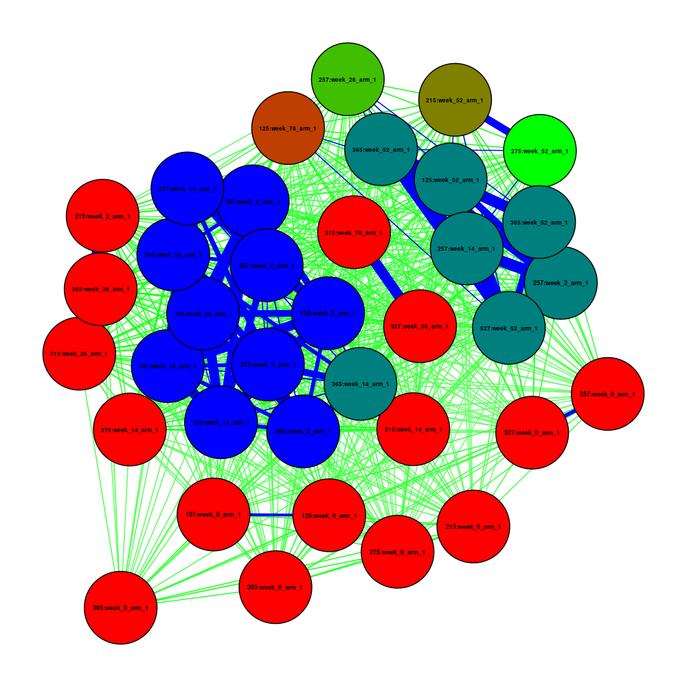
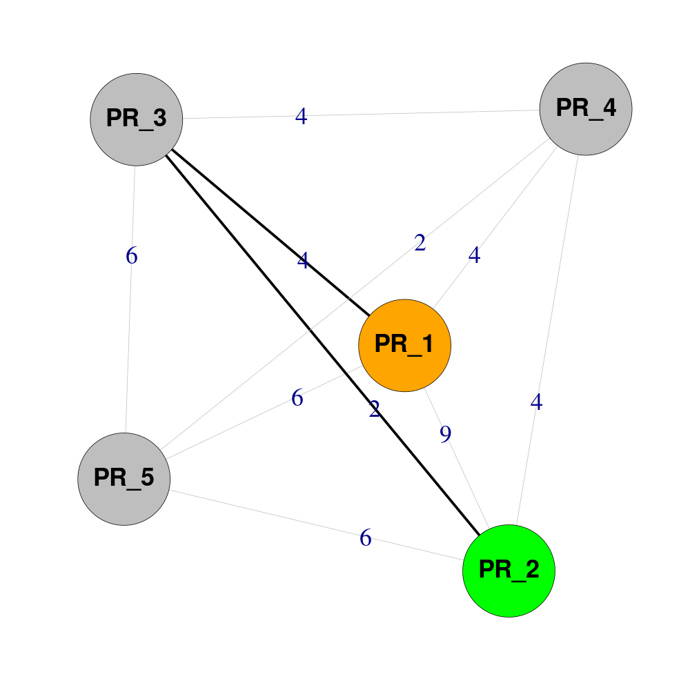

Frequently Asked Questions

## General

??? faq "What does `Pheno-Ranker` do?"

    `Pheno-Ranker` is an open-source toolkit developed for the semantic similarity analysis of phenotypic and clinical data. It natively supports GA4GH standards, such as [Phenopackets v2](pxf.md) and [Beacon v2](bff.md), using as input their JSON/YAML data exchange formats. Beyond these specific standards, Pheno-Ranker is designed to be highly versatile, capable of handling any data serialized into `JSON`, `YAML`, and `CSV` formats, extending its utility beyond the health data domain. Pheno-Ranker transforms hierarchical data into binary digit strings, enabling efficient similarity matching both within cohorts and between individual patients and reference cohorts. 

    ##### last change 2024-09-23 by Manuel Rueda [:fontawesome-brands-github:](https://github.com/mrueda)

??? faq "Is `Pheno-Ranker` free?"

    Yes. See the [license](https://github.com/mrueda/pheno-ranker/blob/main/LICENSE).

    ##### last change 2023-09-23 by Manuel Rueda [:fontawesome-brands-github:](https://github.com/mrueda)

??? faq "Where can I find the Web App user interface?"

    You can find the Web App user interface at this address: [https://pheno-ranker.cnag.eu](https://pheno-ranker.cnag.eu).

    There is a playground that you can use by entering the following credentials:

    **Username:** `pheno`  
    **Password:** `ranker`

    ##### last change 2024-04-01 by Manuel Rueda [:fontawesome-brands-github:](https://github.com/mrueda)

??? faq "Can I export term coverage and intermediate files?"

    Yes. It is possible to export a file indicating **coverage** for each term (i.e., 1D-keys) as well as all **intermediate files** using the flag `--e`.

    On top of that, in _patient mode_, alignment files can be obtained by using `--align`.

    ##### last change 2023-10-13 by Manuel Rueda [:fontawesome-brands-github:](https://github.com/mrueda)

??? faq "How can I exclude a given variable?"

    To exclude a specific variable, you can use one of the following methods:

    1. Utilize the `--include-terms` or `--exclude-terms` options in the command-line interface (CLI).
    2. Implement a regular expression (regex) in the configuration file using the `exclude_variables_regex` parameter.
    3. Assign a weight of zero to the variable in a weights file (indicated by the `--w` flag). This approach offers the most detailed control over variable exclusion.

    ##### last change 2023-12-22 by Manuel Rueda [:fontawesome-brands-github:](https://github.com/mrueda)

??? faq "Can I use `pedigrees` term in `BFF`?"

    A priori, you can, but the term `pedigrees` is excluded by default via [configuration file](https://github.com/CNAG-Biomedical-Informatics/pheno-ranker/blob/main/share/conf/config.yaml). Pedigrees are often case-related, so the information is not relevant for comparison to other cases. Additionally, it contains deeply nested data structures. If you want to include it, please modify the default configuration file and use it with the `--config <your-config-file>` option.

    ##### last change 2024-09-27 by Manuel Rueda [:fontawesome-brands-github:](https://github.com/mrueda)

??? faq "How does `Pheno-Ranker` treat empty and missing values?"

    `Pheno-Ranker` uses categorical variables to define the [binary_digit_vector](algorithm.md). Any key that contains an empty value such as `null`, `{}`, or `[]` is discarded. We also deliberately discard keys with missing values (namely `NA` and `NaN`). On the other hand, any other string such as `Unknown` or `No` is accepted as values and will be incorporated as a category. Thus, if you want missing values to be included as a category, we recommend replacing them with another string (e.g., `Unknown`).

    Now, in the context of one-hot encoded data, missing values are typically represented by zeros, and that's exactly `Pheno-Ranker`'s approach.

    Let's consider the following example:

    ```json
    [
      {
        "id": "PR_1",
        "Name": "Foo"
      },
      {
        "id": "PR_2",
        "Name": "Bar"
      },
      { 
        "id": "PR_3"
      },
      {
        "id": "PR_4",
        "Name": null
      },
      {
        "id": "PR_5",
        "Name": "NA"
      }
    ]
    ```

    We have only one variable (i.e., category) named `Name`. The first two individuals contain valid values, the third does not contain the key, the fourth has it as `null`, and the fifth has `NA`.

    The coverage (see "Can I export term coverage and intermediate files?" above) for the terms will be the following:

    ```json
    {
       "cohort_size" : 5,
       "coverage_terms" : {
          "Name" : 2,
          "id" : 5
       }
    }
    ```

    In which we see that the variable `Name` only has coverage for 2 out of 5 individuals.

    If we run a job with the default metric (Hamming distance) and `--include-terms Name`, the global hash will look like this:
    ```json
    {
       "Name.Bar" : 1,
       "Name.Foo" : 1
    }
    ```

    The binary-digit-vector will look like this:

    ```json
    {
      "PR_1": "01",
      "PR_2": "10",
      "PR_3": "00",
      "PR_4": "00",
      "PR_5": "00"
    }

    ```

    The resulting `matrix.txt` will look like this:

    |       | PR_1 | PR_2 | PR_3 | PR_4 | PR_5 |
    |-------|------|------|------|------|------|
    | PR_1  |  0   |  2   |  1   |  1   |  1   |
    | PR_2  |  2   |  0   |  1   |  1   |  1   |
    | PR_3  |  1   |  1   |  0   |  0   |  0   |
    | PR_4  |  1   |  1   |  0   |  0   |  0   |
    | PR_5  |  1   |  1   |  0   |  0   |  0   |

    In this context, the distance from `PR_1` to `PR_2` is `2` (indicating they differ in two positions), while the distance from `PR_1` to `PR_3`, `PR_4`, and `PR_5` is only `1`. This discrepancy arises because an empty value contributes less to the distance calculation than a non-empty one. While this discrepancy may often be acceptable since the data will still fall into different clusters, an alternative solution to mitigate this issue is to exclude the variable `Name` entirely when running `Pheno-Ranker`. Another, less drastic approach is to employ the Jaccard metric (`--similarity-metric-cohort jaccard`), which is less sensitive to empty values. With the Jaccard index, the resulting matrix will be as follows:


    |       | PR_1 | PR_2 | PR_3 | PR_4 | PR_5 |
    |-------|------|------|------|------|------|
    | PR_1  |  1   | 0.000000 | 0.000000 | 0.000000 | 0.000000 |
    | PR_2  | 0.000000 |  1   | 0.000000 | 0.000000 | 0.000000 |
    | PR_3  | 0.000000 | 0.000000 |  1   | 0.000000 | 0.000000 |
    | PR_4  | 0.000000 | 0.000000 | 0.000000 |  1   | 0.000000 |
    | PR_5  | 0.000000 | 0.000000 | 0.000000 | 0.000000 |  1   |

    When handling missing values within the context of Pheno-Ranker, it's essential to consider the specific characteristics of your dataset, the nature of missingness, and the potential impact on downstream analyses

    ##### last change 2024-08-04 by Manuel Rueda [:fontawesome-brands-github:](https://github.com/mrueda)

??? faq "What is the difference between *Pheno-Ranker Web App UI* and *Pheno-Ranker App*?"

    The [Web App UI](https://pheno-ranker.cnag.eu) is a fully functional web user interface built with `R-Shiny`. The [App](https://github.com/CNAG-Biomedical-Informatics/pheno-ranker-app) is a graphical user interface (GUI) in `Python` designed for those who prefer not to use the command-line interface (CLI). While still experimental, we aim to improve it in the future by incorporating AI agents.

    ##### last change 2023-11-27 by Manuel Rueda [:fontawesome-brands-github:](https://github.com/mrueda)

### Pre-processing

??? faq "How can I create a `JSON` file consisting of a subset of individuals?"

    You can use the tool `jq`:

    ```bash
    # Let's assume you have an array of "id" values in a variable named ids
    ids=( "157a:week_0_arm_1" "157a:week_2_arm_1" )

    # Use jq to filter the array based on the "id" values
    jq --argjson ids "$(printf '%s\n' "${ids[@]}" | jq -R -s -c 'split("\n")')" 'map(select(.id | IN($ids[])))' < individuals.json > subset.json

    ```

    ##### last change 2024-07-02 by Manuel Rueda [:fontawesome-brands-github:](https://github.com/mrueda)

??? faq "I have noticed that in _cohort mode_, `Pheno-Ranker` takes as input an array of objects. Does it also support independent `JSON` files (one per patient)?"

    The simple answer is _yes_. However, what actually happens under the hood is that each independent file is treated as a cohort, and a prefix (defaulting to 'CX_') is added to the primary_key ID. This does not affect the results. Additionally, in colored MDS plots, each patient represented in separate files will be distinguished with a different color.

    If you prefer to combine all independent `JSON` files into a single `JSON` array, consider using one of the following alternatives:

    With the tool `jq`:
    ```bash
    jq -s '.' *.json > combined.json
    ```

    Alternatively, if you want to resort to `Bash`:

    ??? Example "See `Bash` code:"

        ```bash
        #!/bin/bash
        
        # Start the JSON array
        echo '['
        
        # Concatenate the JSON files
        first=1
        for file in *.json; do
            if [[ $first -eq 1 ]]; then
                first=0
            else
                echo ','
            fi
            cat "$file"
        done
        
        # End the JSON array
        echo ']'
        ```

    ##### last change 2024-04-16 by Manuel Rueda [:fontawesome-brands-github:](https://github.com/mrueda)

??? faq "Do you account for `BFF/PXF` schema versions?"

    As of August 2024, we do not explicitly account for BFF/PXF schema versions. In some cases, BFF data may not include a version, requiring us to infer changes. However, most schema updates are downstream and do not impact term-level data. As a result, the overall effect of comparing data from different schema versions is typically minimal. We assume that users are aware of the versions they are working with and understand the implications of using data from different schema versions.

    ##### last change 2024-08-11 by Manuel Rueda [:fontawesome-brands-github:](https://github.com/mrueda)


### Post-processing

??? faq "How do I store `Pheno-Ranker`'s data in a relational database?"

    First, export intermediate files using the following command:

    ```bash
    pheno-ranker -r individuals.json -e my_export_data
    ```

    This command will generate a set of intermediate files, and the one you'll need for queries is `my_export_data.ref_binary_hash.json`.

    To convert the `JSON` data to `CSV`, you can use various methods, but we recommend using the `jq` tool:

    ```bash
    jq -r 'to_entries[] | [.key, .value.binary_digit_string] | @csv' < my_export_data.ref_binary_hash.json | awk 'BEGIN {print "id,binary_digit_string"}{print}' > output.csv
    ```

    The results are now stored at `output.csv`

    Finally, store the data in your database as you will usually do.

    ##### last change 2023-10-13 by Manuel Rueda [:fontawesome-brands-github:](https://github.com/mrueda)

??? faq "Can I Perform MDS with Jaccard Indices?"
    Yes, you can perform Multidimensional Scaling (MDS) using a matrix of Jaccard indices. To use MDS, which typically requires dissimilarity data, you'll need to convert your Jaccard similarity matrix into a dissimilarity matrix. This is done by subtracting the Jaccard similarity scores from 1, where the formula is:

    $$ D = 1 - J $$
    Where:
    \( D \) is the dissimilarity.
    \( J \) is the Jaccard index.

    This conversion ensures that higher similarities translate into shorter distances for MDS, facilitating accurate low-dimensional representations of the data.

    Example `R` code:

    ```R
    # Load the matrix of Jaccard similarities from a text file
    data <- as.matrix(read.table("matrix.txt", header = TRUE, row.names = 1, check.names = FALSE))
    
    # Convert Jaccard similarity matrix to a dissimilarity (distance) matrix
    dissimilarity_matrix <- 1 - data
    
    # Perform classical Multidimensional Scaling (MDS) using the dissimilarity matrix
    # 'eig=TRUE' allows the function to return eigenvalues
    # 'k=2' sets the number of dimensions for the MDS output
    fit <- cmdscale(dissimilarity_matrix, eig=TRUE, k=2)
    
    # Additional analysis and plotting code here
    ...
    ```

    ##### last change 2024-04-15 by Manuel Rueda [:fontawesome-brands-github:](https://github.com/mrueda)

??? faq "Can I convert a Hamming distance matrix to a similarity matrix?"
     
    First of all, if you are seeking a similarity metric, you might want to consider using `jaccard` as a metric. However, if you wish to convert a distance-based matrix to a similarity matrix, you can use the following formula:
     
    $$ S = 1 - \frac{d}{n} $$
    Where:
    \( S \) is the similarity.
    \( d \) is the Hamming distance.
    \( n \) is the number of characters compared in the Hamming distance.
     
    Example `R` code:
     
    ```R
    # Load the matrix of Hamming distances from a text file
    data <- as.matrix(read.table("matrix.txt", header = TRUE, row.names = 1, check.names = FALSE))
    
    # Set n (extracted with --export option)
    n = 100
     
    # Convert Hamming distance to a similarity matrix
    similarity_matrix <- 1 - (data / n)
     
    # Additional analysis and plotting code here
    ...
    ```

    ##### last change 2024-04-15 by Manuel Rueda [:fontawesome-brands-github:](https://github.com/mrueda)

??? faq "How can I convert a Hamming distance matrix to a standardized matrix?"

    We recommed using `R` for this task. See example below:

    Example `R` code:

    ```R
    # Load the matrix of Hamming distances from a text file
    data <- as.matrix(read.table("matrix.txt", header = TRUE, row.names = 1, check.names = FALSE))

    # Step 2: Extract numeric matrix
    numeric_matrix <- as.matrix(data)  # Assumes non-numeric first column is already set as row.names

    # Step 3: Standardize to z-scores
    z_score_matrix <- scale(numeric_matrix)

    # Step 4: Reassemble the matrix with labels
    standardized_matrix <- as.data.frame(z_score_matrix)
    row.names(standardized_matrix) <- row.names(data)

    # Step 5: Save the standardized matrix
    write.table(standardized_matrix, "standardized_matrix.txt", sep = "\t", quote = FALSE, col.names = NA)
    ```

    ##### last change 2024-11-26 by Manuel Rueda [:fontawesome-brands-github:](https://github.com/mrueda)

??? faq "Can I create network/graph plots from `Pheno-Ranker` output data?"

    Absolutely, you can—the possibilities are endless! :smile:

    `Pheno-Ranker` can generate graph data in [JSON format](https://github.com/CNAG-Biomedical-Informatics/pheno-ranker/blob/main/t/graph.json) which is compatible with the [Cytoscape](https://cytoscape.org/) ecosystem. To create a graph, you can execute the following command:

    ```bash
    pheno-ranker -r individuals.json --cytoscape-json cytoscape_graph.json
    ```

    If you like to get summary statistics for the graph use it in conjunction with `--graph-stats`, like this:
    
    ```bash
    pheno-ranker -r individuals.json --cytoscape-json cytoscape_graph.json --graph-stats my_graph_stats.txt
    ```
   
    The file `my_graph_stats.txt` will include summary statistics and the [shortest path](https://en.wikipedia.org/wiki/Shortest_path_problem) between all nodes. Be aware that this calculation may be time-consuming for large graphs.

    Alternatively, you can use `R` for more graphical options. Here are some examples using the [qgraph](https://www.rdocumentation.org/packages/qgraph/versions/1.9.8/topics/qgraph) and [igraph](https://r.igraph.org/) packages:

    ???+ Tip "Reference cohort"
         <figure markdown>
          {width="350"}
          <figcaption>REF qgraph plot</figcaption>
         </figure>


        ??? Example "See code"
    
            First, we run `Pheno-Ranker` in _cohort mode_ using `jaccard` as a metric:
    
            ```bash
            pheno-ranker -r individuals.json --similarity-metric-cohort jaccard
            ```
    
            Now we plot the resulting `matrix.txt` file.
    
            #### Coloring Nodes and Edges:
    
            - **Nodes**: Colored based on the count of connections exceeding a specified threshold, using a gradient from red (fewer connections) to blue (more connections).
            - **Edges**: Colored by weight, with blue for the strongest connections (weight > 0.90), green for strong connections (weight > 0.50), and red for weaker ones.
    
            ```R
            # Install the necessary packages if not already installed
            if (!requireNamespace("qgraph", quietly = TRUE)) {
                install.packages("qgraph")
            }
            library(qgraph)
            data <- as.matrix(read.table("matrix.txt", header = TRUE, row.names = 1, check.names = FALSE))
            
            # Start PNG device
            png(filename = "qgraph.png", width = 1000, height = 1000,
                units = "px", pointsize = 12, bg = "white", res = NA)
            
            # Toggle for coloring the last node black
            colorLastNodeBlack <- FALSE  # Change to TRUE for black / FALSE to retain original color
            
            # Function to determine color based on threshold values
            getColorBasedOnThreshold <- function(value, thresholdHigh, thresholdMid, colorHigh, colorMid, colorLow) {
              if (value > thresholdHigh) {
                return(colorHigh)
              } else if (value > thresholdMid) {
                return(colorMid)
              } else {
                return(colorLow)
              }
            }
            
            # Apply this function to each node and edge
            node_thresholds <- apply(data, 1, function(x) sum(x > 0.9))
            max_node_threshold <- max(node_thresholds)
            min_node_threshold <- min(node_thresholds)
            normalized_node_thresholds <- (node_thresholds - min_node_threshold) / (max_node_threshold - min_node_threshold)
            
            # Color nodes based on normalized threshold
            node_colors <- colorRampPalette(c("red", "green", "blue"))(length(unique(normalized_node_thresholds)))
            node_colors <- node_colors[as.integer(cut(normalized_node_thresholds, breaks = length(node_colors), include.lowest = TRUE))]
            
            # Conditionally color the last node black
            if (colorLastNodeBlack) {
                node_colors[length(node_colors)] <- "black"  # Last node in black
            }
            
            # Edge colors with similar logic
            edge_colors <- apply(data, c(1,2), function(x) getColorBasedOnThreshold(x, 0.90, 0.50, "blue", "green", "red"))
            edge_colors <- matrix(edge_colors, nrow=nrow(data), ncol=ncol(data))
            
            # Create and plot the graph
            qgraph(data,
                   labels=colnames(data),
                   layout='spring',
                   label.font=2,  # Bold labels
                   vsize=10,      # Node size
                   threshold=0.50,  # Edge visibility threshold
                   shape='circle',
                   color=node_colors,  # Node colors
                   edge.color=edge_colors,  # Edge colors
                   edge.width=1)  # Edge width
            
            # Close the device to save the PNG file
            dev.off()
            ```

    ???+ Tip "Reference cohort - Target patient"

        <figure markdown>
         {width="350"}
         <figcaption>REF-TAR qgraph plot</figcaption>
        </figure>


        ??? Example "See code"
    
            Again, we run `Pheno-Ranker` in _cohort mode_, adding `individuals.json` and `patient.json` as if they were two cohorts, using `jaccard` as a metric:

            ```bash
            pheno-ranker -r individuals.json patient.json --append-prefixes REF TAR --similarity-metric-cohort jaccard
            ```

            Now we plot the resulting `matrix.txt` file, but this time the `TAR_107:week_0_arm_1` (last element) node is colored black to be more visible.
    
            #### Coloring Nodes and Edges:
    
            - **Nodes**: Colored based on the count of connections exceeding a specified threshold, using a gradient from red (fewer connections) to blue (more connections).
            - **Edges**: Colored by weight, with blue for the strongest connections (weight > 0.90), green for strong connections (weight > 0.50), and red for weaker ones.
    
            ```R
            # Install the necessary packages if not already installed
            if (!requireNamespace("qgraph", quietly = TRUE)) {
                install.packages("qgraph")
            }
            library(qgraph)
            data <- as.matrix(read.table("matrix.txt", header = TRUE, row.names = 1, check.names = FALSE))
            
            # Start PNG device
            png(filename = "qgraph.png", width = 1000, height = 1000,
                units = "px", pointsize = 12, bg = "white", res = NA)
            
            # Toggle for coloring the last node black
            colorLastNodeBlack <- TRUE  # Change to TRUE for black / FALSE to retain original color
            
            # Function to determine color based on threshold values
            getColorBasedOnThreshold <- function(value, thresholdHigh, thresholdMid, colorHigh, colorMid, colorLow) {
              if (value > thresholdHigh) {
                return(colorHigh)
              } else if (value > thresholdMid) {
                return(colorMid)
              } else {
                return(colorLow)
              }
            }
            
            # Apply this function to each node and edge
            node_thresholds <- apply(data, 1, function(x) sum(x > 0.9))
            max_node_threshold <- max(node_thresholds)
            min_node_threshold <- min(node_thresholds)
            normalized_node_thresholds <- (node_thresholds - min_node_threshold) / (max_node_threshold - min_node_threshold)
            
            # Color nodes based on normalized threshold
            node_colors <- colorRampPalette(c("red", "green", "blue"))(length(unique(normalized_node_thresholds)))
            node_colors <- node_colors[as.integer(cut(normalized_node_thresholds, breaks = length(node_colors), include.lowest = TRUE))]
            
            # Conditionally color the last node black
            if (colorLastNodeBlack) {
                node_colors[length(node_colors)] <- "black"  # Last node in black
            }
            
            # Edge colors with similar logic
            edge_colors <- apply(data, c(1,2), function(x) getColorBasedOnThreshold(x, 0.90, 0.50, "blue", "green", "red"))
            edge_colors <- matrix(edge_colors, nrow=nrow(data), ncol=ncol(data))
            
            # Create and plot the graph
            qgraph(data,
                   labels=colnames(data),
                   layout='spring',
                   label.font=2,  # Bold labels
                   vsize=10,      # Node size
                   threshold=0.50,  # Edge visibility threshold
                   shape='circle',
                   color=node_colors,  # Node colors
                   edge.color=edge_colors,  # Edge colors
                   edge.width=1)  # Edge width
            
            # Close the device to save the PNG file
            dev.off()
            ```

    ???+ Tip "Reference cohort - Shortest path between two individuals"

        <figure markdown>
         {width="350"}
         <figcaption>REF igraph plot</figcaption>
        </figure>


        ??? Example "See code"

            Imagine that `Pheno-Ranker` has created a `matrix.txt` with this content:

            |      | PR_1 | PR_2 | PR_3 | PR_4 | PR_5 |
            |------|------|------|------|------|------|
            | PR_1 | 0    | 9    | 4    | 4    | 6    |
            | PR_2 | 9    | 0    | 2    | 4    | 6    |
            | PR_3 | 4    | 2    | 0    | 4    | 6    |
            | PR_4 | 4    | 4    | 4    | 0    | 2    |
            | PR_5 | 6    | 6    | 6    | 2    | 0    |

            You want to know the shortest path between `PR_1` and `PR_2` (Hamming distance = 9). Let's process it with `R`:
 
            ```R
            # Install the necessary packages if not already installed
            if (!requireNamespace("igraph", quietly = TRUE)) {
                install.packages("igraph")
            }
            library(igraph)
            
            # Define start and end nodes
            START_NODE <- "PR_1"
            END_NODE <- "PR_2"
            
            # Read the data matrix from a file, assuming it's a distance matrix
            data <- as.matrix(read.table("matrix.txt", header = TRUE, row.names = 1, check.names = FALSE))
            
            # Adjust weights of zero to a small positive value for calculation
            data[data == 0] <- 1e-10
            
            # Create an igraph graph from the adjusted distance matrix
            g <- graph_from_adjacency_matrix(data, mode = "undirected", weighted = TRUE, diag = FALSE)
            
            # Set node names
            V(g)$label <- V(g)$name  # assuming node names are already defined
            
            # Find the shortest paths between START_NODE and END_NODE
            shortest_path <- shortest_paths(g, from = START_NODE, to = END_NODE, mode = "out", output = "vpath")
            
            # Extract the edges in the shortest path
            edges_in_path <- E(g, path = unlist(shortest_path$vpath))
            
            # Define colors for vertices and edges
            vertex_colors <- ifelse(V(g)$name == START_NODE, "orange", ifelse(V(g)$name == END_NODE, "green", "grey"))
            edge_colors <- ifelse(E(g) %in% edges_in_path, "black", "grey")
            edge_widths <- ifelse(E(g) %in% edges_in_path, 3, 0.2)
            
            # Prepare edge labels to display original values
            edge_labels <- ifelse(E(g)$weight == 1e-10, 0, E(g)$weight)
            
            # Start PNG device
            png(filename = "igraph.png", width = 1000, height = 1000,
                units = "px", pointsize = 12, bg = "white", res = NA)
            
            # Plot the graph
            plot(g, layout = layout_nicely(g),
                 edge.label.cex = 3,  # Edge label size
                 edge.color = edge_colors,
                 edge.width = edge_widths,
                 edge.label = edge_labels,  # Use adjusted labels for display
                 label.font=2,  # Bold labels
                 label.distance = 1,
                 vertex.color = vertex_colors,
                 vertex.size = 40,  # Increased node size
                 vertex.label.cex = 3.0, # Size of labels
                 vertex.label.color = "black", # Label color
                 vertex.label.font = 2, # Bold labels
                 vertex.label.family = "sans", # Font family
                 vertex.label.fontcolor = "black") # Font color
            dev.off()
            ```

    ##### last change 2024-04-15 by Manuel Rueda [:fontawesome-brands-github:](https://github.com/mrueda)

## Installation

??? faq "From where can I download the software?"

    Should you opt for the **command-line interface**, we suggest obtaining the software from the [CPAN distribution](https://cnag-biomedical-informatics.github.io/pheno-ranker/usage/#method-1-from-cpan), which additionally includes the utility [bff-pxf-simulator](https://cnag-biomedical-informatics.github.io/pheno-ranker/bff-pxf-simulator) and the `CSV` [importer](https://cnag-biomedical-informatics.github.io/pheno-ranker/csv-import). You can find addtional information [here](download-and-installation.md).

    ##### last change 2024-29-03 by Manuel Rueda [:fontawesome-brands-github:](https://github.com/mrueda)

