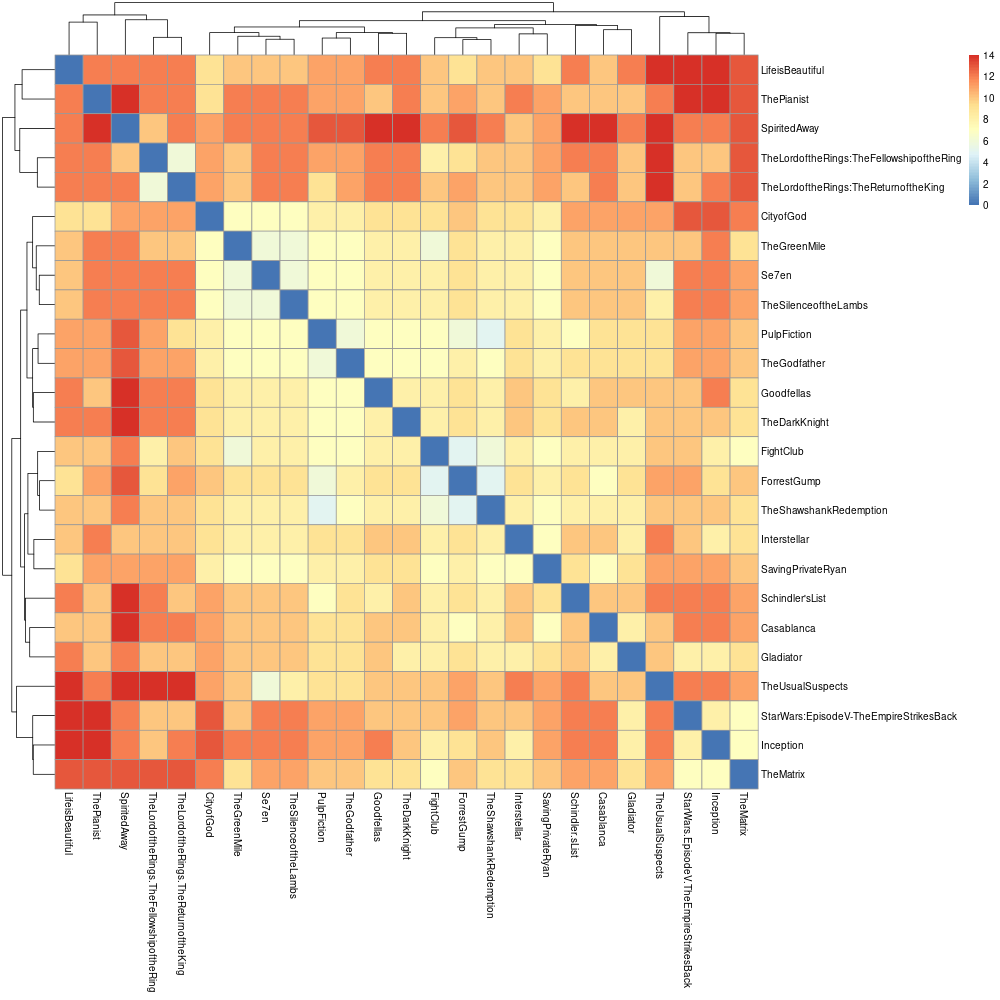
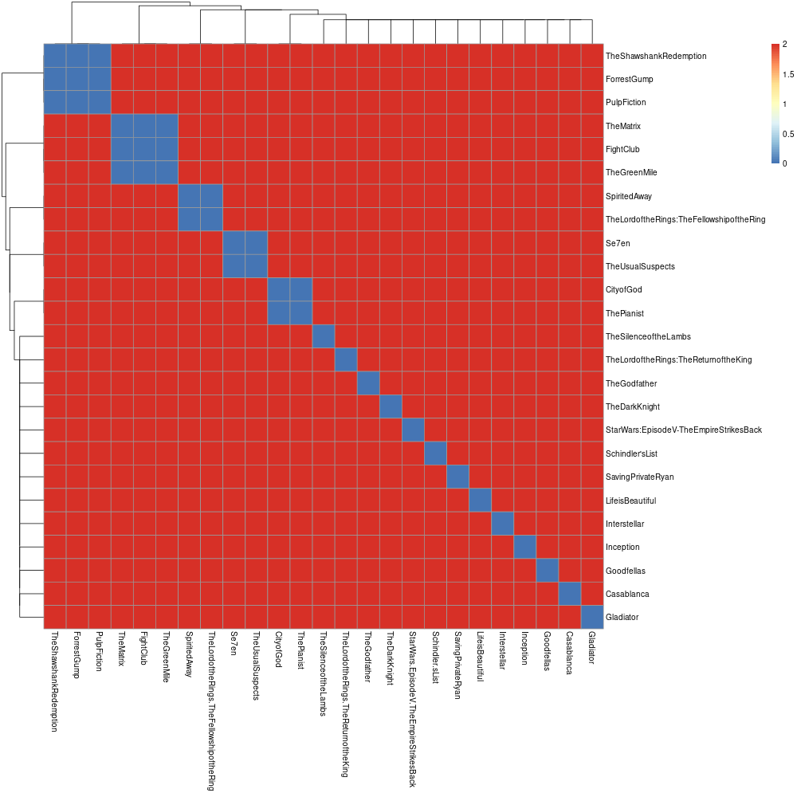
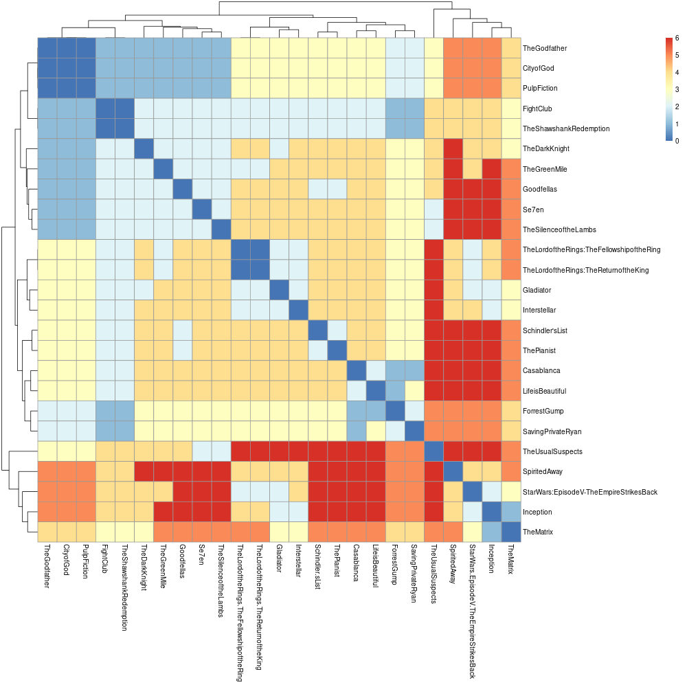
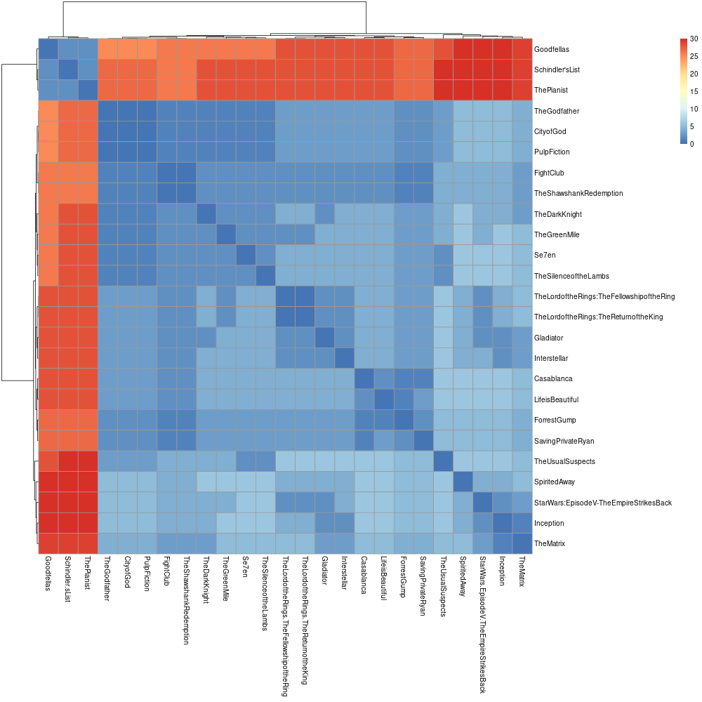
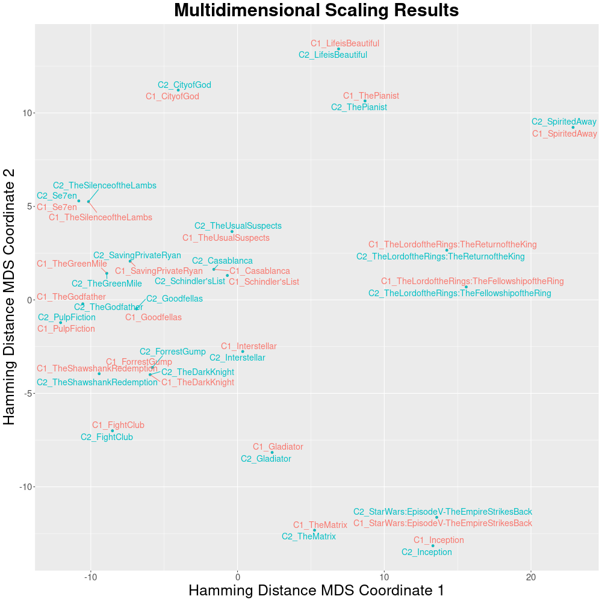
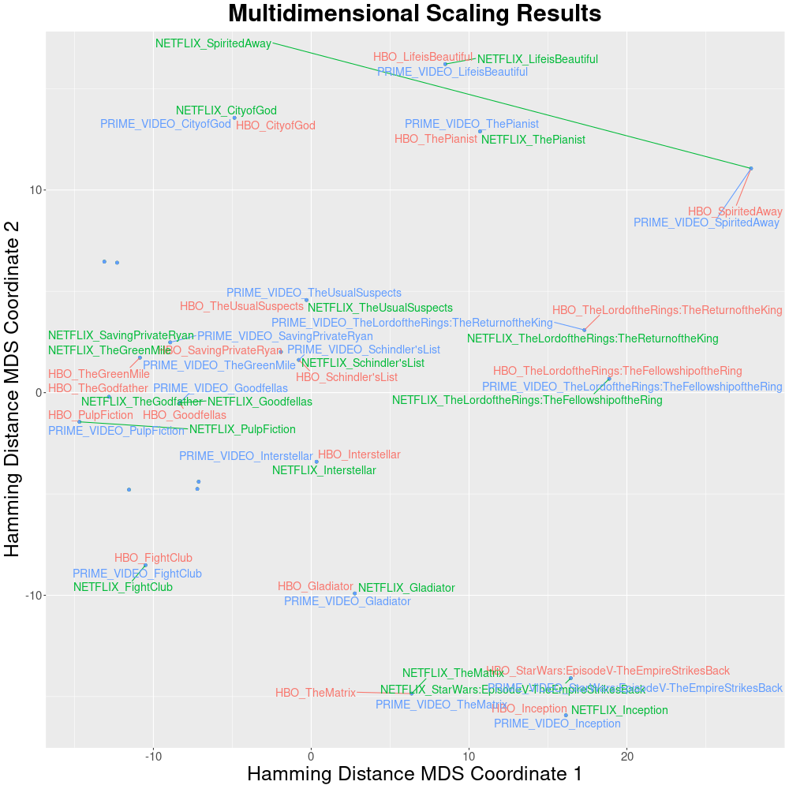

??? Tip "Google Colab notebook"
    Try out `Pheno-Ranker` using our [Google Colab](https://colab.research.google.com/drive/1n3Etu4fnwuDWNveSMb1SzuN50O2a05Rg#scrollTo=8tbJ0f5-hJAB) notebook. You can view it without signing in, but running the code requires a Google account.

    <a target="_blank" href="https://colab.research.google.com/drive/1n3Etu4fnwuDWNveSMb1SzuN50O2a05Rg#scrollTo=8tbJ0f5-hJAB">
      
    </a>

    We also have a local copy of the notebook that can be downloaded from the [repo](https://github.com/CNAG-Biomedical-Informatics/pheno-ranker/blob/main/nb/convert_pheno_cli_tutorial.ipynb). 

???+ Warning "About this tutorial"
    This tutorial deliberately uses generic JSON data (i.e., movies) to illustrate the capabilities of `Pheno-Ranker`, as starting with familiar examples can help you better grasp its usage.

    Once you are comfortable with the concepts using movie data, you will find it easier to apply `Pheno-Ranker` to real GA4GH standards. For specific examples, please refer to the [cohort](cohort.md) and [patient](patient.md) pages in this documentation.

### Moviepackets

For this tutorial, we will use **Moviepackets** to show how `Pheno-Ranker` can work with generic `JSON` files.

<figure markdown>
 MoviePackets logo
 { width="300" }
 <figcaption>Image created by ChatGPT4o</figcaption>
</figure>

??? Question "What is a Moviepacket (MXF) file?"
    A Moviepacket is an invented data exchange format :smile: designed for movies. In this tutorial it plays the same role that Phenotype Exchange Format ([PXF](pxf.md)) plays for pheno-clinical data: it is simply the input data model.


Imagine you have a catalog of 25 movies described in `JSON` format. Each movie is one record, and each record has several properties, such as `title`, `genre`, `year`, `country`, and `rating`. In `Pheno-Ranker` documentation, these selectable properties are often called `terms`.

??? Example "See JSON"

    ```json
    --8<-- "https://raw.githubusercontent.com/CNAG-Biomedical-Informatics/pheno-ranker/refs/heads/main/share/ex/movies.json"
    ```

You are interested in checking the variety of your catalog and plan to use `Pheno-Ranker`. Because Moviepackets are not one of the built-in formats, the first thing to create is a **configuration file**.

??? Question "What is a `Pheno-Ranker` configuration file?"
    A configuration file is a text file in [YAML](https://en.wikipedia.org/wiki/YAML) format ([JSON](https://en.wikipedia.org/wiki/JSON) is also accepted) that tells `Pheno-Ranker` how to interpret your input. It is particularly important when you are not using the two supported formats _out-of-the-box_: [BFF](bff.md) and [PXF](pxf.md).

??? Tip "Do I need to create a configuration file?"
    This file only has to be created if you are working with **your own JSON format**. If you have `CSV`, please go to this [page](csv-import.md).

    If your file format resembles Moviepackets, you can use the Moviepacket configuration as a template. Just ensure you **modify the terms** to align with your data.

    ### How custom JSON is interpreted

    For a custom JSON format, the configuration answers four practical questions:

    - `primary_key`: Which field identifies each record? For Moviepackets, this is `title`.
    - `allowed_terms`: Which fields can be used in comparisons or selected with `--include-terms` / `--exclude-terms`?
    - `array_terms`: Which fields contain arrays? For Moviepackets, `genre` is an array.
    - `id_correspondence`: If a field is an array, which value should be used to name each array element after flattening?

    In the Moviepacket example, `rating` exists in the JSON data but is not listed in `allowed_terms`; therefore it is not used in the tutorial comparisons. This keeps the example categorical and avoids mixing in quantitative values.

    ### Creating a configuration file
    
    To create a configuration file, start by reviewing the [example file](https://github.com/cnag-biomedical-informatics/pheno-ranker/blob/main/t/data/movies_config.yaml) provided with the installation. The goal is to replace its values with those from your project. If your movies did not have array-based properties, the configuration file would look like this:
    
    ```yaml
    # Set the format
    format: MXF # Optional unless you have array-based properties
    
    # Set the primary key for the objects
    primary_key: title
    
    # Set the allowed terms or properties for use with include|exclude-terms
    allowed_terms: [country,genre,year]
    ```
    
    Because the Moviepacket data has the term `genre`, which is an `array`, the file looks like this:
    
    ```yaml
    # Set the format
    format: MXF
    
    # Set the primary key for the objects
    primary_key: title
    
    # Set the allowed terms or properties for use with include|exclude-terms
    allowed_terms: [country,genre,year,title]
    
    # Set the terms which are arrays
    array_terms: [genre]
    
    # Set the regex to identify array indexes, guiding their substitution within array elements
    array_regex: '^([^:]+):(\d+)'
    
    # Set the path to select values for substituting array indexes
    id_correspondence:
      MXF:
        genre: genre
    ```
    
    The table below summarizes which parameters are needed depending on the format:
    
    | Format      | Required properties | Optional properties | Pre-configured |
    | ----------- | ------------------- | ------------------- |  -----  | 
    | BFF / PXF   | `primary_key, allowed_terms, array_terms, array_regex, id_correspondence` | `format` | ✓ |
    | Others (`array`) | `format, primary_key, allowed_terms, array_terms, id_correspondence` | `array_regex` | ✗ |
    | Others (`non-array`) |  `primary_key, allowed_terms` | `format` | ✗ |
    
    
     * Where:
        - **format** is a `string` that defines your particular format. In this case, it is `MXF`. It has to match the key used under `id_correspondence`.
        - **primary_key** is the key that will be used as the record identifier.
        - **allowed_terms** is an array that lists the terms permitted for use with `--include-terms` and `--exclude-terms`. This helps validate input and catch typos. If `--include-terms` or `--exclude-terms` are not specified, all terms present in the JSON file can be considered.
        - **array_terms** is an array that lists which properties are arrays.
        - **array_regex** is a string used to parse flattened keys. It is used together with `id_correspondence`.
        - **id_correspondence** is an object that, together with `array_regex`, renames array elements so comparisons do not rely on numeric indexes.
    
### Running `Pheno-Ranker`

Once you have created the configuration file, you can run `pheno-ranker` with the **command-line interface**.

=== "Intra-catalog comparison"

    ## Example 1: Let's start by using all configured terms

    ```bash
    pheno-ranker -r t/data/movies.json --config t/data/movies_config.yaml
    ```

    The result is a file named `matrix.txt`. In this run, `Pheno-Ranker` uses the terms allowed by `t/data/movies_config.yaml`. Find below the result of clustering the matrix with `R`.

    ??? Example "Included R scripts"

        You can find in the link below a few examples to perform clustering and multidimensional scaling with your data:

        [R scripts at GitHub](https://github.com/CNAG-Biomedical-Informatics/pheno-ranker/tree/main/share/r).

    <figure markdown>
      { width="600" }
      <figcaption>Intra-cohort pairwise comparison</figcaption>
    </figure>

    ## Example 2: Let's cluster by year

    ```bash
    pheno-ranker -r t/data/movies.json --include-terms year --config t/data/movies_config.yaml
    ```

    <figure markdown>
      { width="600" }
      <figcaption>Intra-cohort pairwise comparison</figcaption>
    </figure>

    ## Example 3: Let's cluster by `genre`

    ```bash
    pheno-ranker -r t/data/movies.json --include-terms genre --config t/data/movies_config.yaml
    ```

    <figure markdown>
       { width="600" }
       <figcaption>Intra-cohort pairwise comparison</figcaption>
    </figure>

    ## Example 4: Let's apply weights to `genre`

    We will use the file `t/data/movies_weights.yaml` that has the following content:

    ```yaml
    ---
    genre.Biography: 25
    ```

    ```bash
    pheno-ranker -r t/data/movies.json --include-terms genre --w t/data/movies_weights.yaml --config t/data/movies_config.yaml
    ```

    <figure markdown>
      { width="600" }
      <figcaption>Intra-cohort pairwise comparison</figcaption>
    </figure>

    ## Example 5: Let's create a graph to be used in Cytoscape

    `Pheno-Ranker` can export a graph in a `JSON` format that is compatible with the [Cytoscape](https://cytoscape.org) ecosystem:

    ```bash
    pheno-ranker -r t/data/movies.json --cytoscape-json cytoscape.json --graph-stats graph_stats.txt --config t/data/movies_config.yaml
    ```

    !!! Question "Directed or undirected graph?" 
        The `cytoscape.json` file contains one edge per pairwise comparison and avoids duplicated symmetric edges. The graph is intended to be interpreted as **undirected** for visual purposes. Ensure that your application logic or analysis tools interpret this accordingly if they rely on undirected connectivity.

    ??? Example "See `cytoscape.json`"


        ```json
        --8<-- "data/movies_cytoscape.json"
        ```

    ???+ Example "Display plot"
    
        <div id="cy2" style="width: 100%; height: 500px; border: 1px solid black;"></div>
       
        <script>
          document.addEventListener("DOMContentLoaded", function () {
            const repoName = "pheno-ranker"; // Change this if needed
            loadCytoscapeGraph("cy2", "/data/movies_cytoscape.json", repoName, 50);
           });
        </script>
        
    ??? Example "See `graph_stats.txt`"
    
        ```bash
        --8<-- "data/graph_stats.txt"
        ```

=== "Inter-catalog comparison"

    Imagine you have several **Moviepacket** :smile: catalogs and you want to compare the similarity among them.

    The way you compute this with `Pheno-Ranker` is similar to the intra-catalog example. The main difference is that the catalogs (i.e., cohorts) receive prefixes so that records from different input files can be identified.

    ## Example 1: Default catalog (cohort) nomenclature 

    For demonstration purposes, this example reuses the same file (`t/data/movies.json`):

    ```bash
    pheno-ranker -r t/data/movies.json t/data/movies.json --config t/data/movies_config.yaml
    ```

    After executing this command, you will obtain a file named `matrix.txt`, consisting of all `(25+25) x (25+25)` pairwise comparisons.

    !!! Abstract "Dimensionality reduction"
        We will use the included [R scripts](https://github.com/CNAG-Biomedical-Informatics/pheno-ranker/tree/main/share/r) to perform dimensionality reduction via [MDS](https://en.wikipedia.org/wiki/Multidimensional_scaling). Note that you can use other dimensionality reduction techniques such as t-SNE or UMAP.

    <figure markdown>
      { width="600" }
      <figcaption>Inter-catalog multidimensional scaling</figcaption>
    </figure>


    By default, the IDs in each catalog will be renamed to `C1_`, `C2_` and so on, but you can add your own prefixes with `--append-prefixes`.

    ## Example 2: Set up catalog nomenclature prefixes 

    ```bash
    pheno-ranker -r t/data/movies.json t/data/movies.json t/data/movies.json --append-prefixes NETFLIX HBO PRIME_VIDEO --config t/data/movies_config.yaml
    ```

    <figure markdown>
      { width="600" }
      <figcaption>Inter-catalog multidimensional scaling</figcaption>
    </figure>

=== "Movie recommendations"

    Imagine you'd like to discover movies similar to a specific one, such as [Interstellar](https://en.wikipedia.org/wiki/Interstellar_(film)).

    ## Step 1: Isolate the Movie

    To single out the `Interstellar` movie data:

    ```bash
    pheno-ranker -r t/data/movies.json --patients-of-interest Interstellar --config t/data/movies_config.yaml
    ```

    This command will carry out a dry-run, producing an extracted JSON object named `Interstellar.json`.

    ```json
    --8<-- "tbl/Interstellar.json"
    ```
 

    ## Step 2: Rank Similar Movies

    Next, run the following command to initiate the ranking process:

    ```bash
    pheno-ranker -r t/data/movies.json -t Interstellar.json --config t/data/movies_config.yaml
    ```

    This will output the results to the console and additionally save them in a file titled `rank.txt`.

    ??? Example "See `rank.txt`"

        --8<-- "tbl/rank_movies.md"

    You can also perform the ranking against multiple cohorts and select specific terms.

    ```bash
    pheno-ranker -r t/data/movies.json t/data/movies.json --append-prefixes NETFLIX HBO -t Interstellar.json --include-terms genre year --config t/data/movies_config.yaml --max-out 10
    ```

    ??? Example "See `rank.txt`"

        --8<-- "tbl/rank_movies_inter.md"
