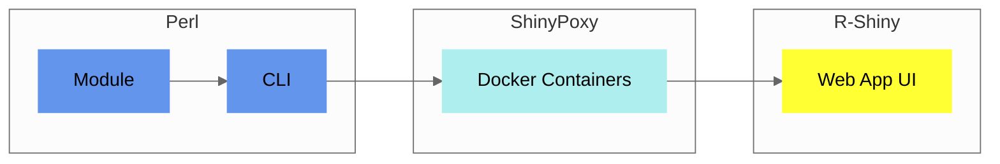

## Components

The core of `Pheno-Ranker` is a [Perl module](https://metacpan.org/pod/Pheno%3A%3ARanker), accessible through a [command-line interface](usage.md).

<figcaption>Diagram showing Pheno-Ranker implementation</figcaption>

A [Web App UI](https://cnag-biomedical-informatics.github.io/convert-pheno-ui) enhances its functionality, built upon this [command-line interface](usage.md).

!!! Tip "Which one should I use?"
    Start with the `Pheno-Ranker` [Web App UI Playground](https://pheno-ranker.cnag.eu) for a practical introduction. When you're ready for more advanced features, turn to the [CLI](usage.md).

## Utils

We include several utilities:

1. [bff-pxf-simulator](./simulator.md) to simulate BFF/PXF data
2. [csv2pheno-ranker](./csv-import.md) to enable using `Pheno-Ranker` with `CSV`.
2. [QR encoder/decoder](./qr-generator.md) to transform data into a QR code.
