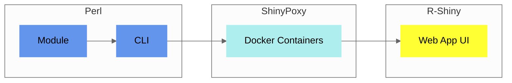

## Components

The core of `Pheno-Ranker` is a [Perl module](https://metacpan.org/pod/Pheno%3A%3ARanker), accessible through a [command-line interface](usage.md#synopsis).

A [Web App UI](https://pheno-ranker.cnag.eu) enhances its functionality, built with [R-Shiny](https://shiny.posit.co).

<figcaption>Diagram showing Pheno-Ranker implementation</figcaption>

!!! Tip "Which one should I use?"
    - **For a quick and practical start**, try the [`Pheno-Ranker` Web App UI](https://pheno-ranker.cnag.eu). It's an intuitive, browser-based interface for straightforward usage.
    - **For advanced features**, explore the [Command-Line Interface (CLI)](usage.md), which offers greater control and flexibility.
    - **For desktop users**, we provide an [experimental desktop GUI](https://github.com/mrueda/pheno-ranker-app). This is a simple graphical interface for the CLI, designed for local use but still in an early stage of development.

## Utilities

`Pheno-Ranker` includes several utilities:

1. [bff-pxf-plot](./bff-pxf-plot.md) to create summary statistcs for BFF/PXF data.
2. [bff-pxf-simulator](./bff-pxf-simulator.md) to simulate BFF/PXF data.
3. [csv2pheno-ranker](./csv-import.md) to enable using `Pheno-Ranker` with `CSV`.
4. [QR encoder/decoder](./qr-code-generator.md) to transform data (back and forth) into QR codes and `PDF` reports.
