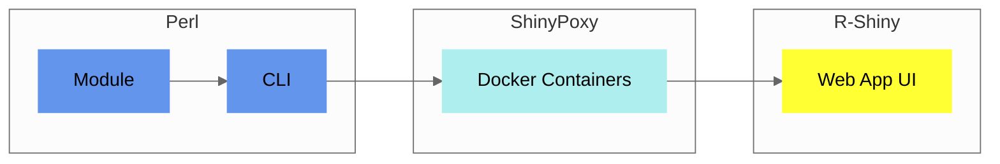

## Components

The core of `Pheno-Ranker` is a [Perl module](https://metacpan.org/pod/Pheno%3A%3ARanker), accessible through a [command-line interface](usage.md).

<figcaption>Diagram showing Pheno-Ranker implementation</figcaption>

A [Web App UI](https://cnag-biomedical-informatics.github.io/convert-pheno-ui) enhances its functionality, built upon this [command-line interface](usage.md).

!!! Tip "Which one should I use?"
    Initiate your exploration of `Pheno-Ranker` through the hands-on experience provided by our [Web App UI Playground](https://pheno-ranker.cnag.cat), and as your needs evolve, the advanced functionalities of the [CLI](usage.md) will prove to be essential.

## Software architecture

The [core module](https://metacpan.org/pod/Pheno::Ranker) is divided into various sub-modules. The main package, `Pheno::Ranker`, handles class initialization and employs the [Moo](https://metacpan.org/pod/Moo) module along with [Types::Standard](https://metacpan.org/pod/Types::Standard) for data validation. 

## Utils

We include two utilities:

1. [bff-pxf-simulator](./simulator.md) to simulate BFF/PXF data
2. [csv2pheno-ranker](./csv-import.md) to enable using `Pheno-Ranker` with `CSV`.
