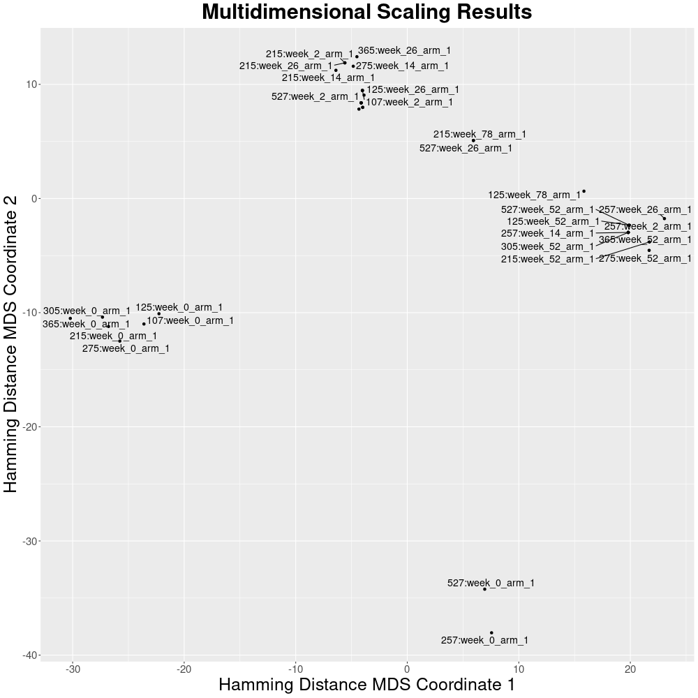

**BFF** stands for **B**eacon **F**riendly **F**ormat. The [BFF](https://b2ri-documentation.readthedocs.io/en/latest/data-ingestion) consists of 7 `JSON` files that match the 7 entities of the [Beacon v2 Models](https://docs.genomebeacons.org/models).

<figure markdown>
   { width="400" }
   <figcaption> Heatmap of a intra-cohort pairwise comparison</figcaption>
</figure>

!!! Abstract "About Beacon v2 Models' entities"
    Of the seven entities in the Beacon v2 Models, [individuals](https://docs.genomebeacons.org/schemas-md/individuals_defaultSchema) is typically the only one that contains phenotypic data. Other entities such as [datasets](https://docs.genomebeacons.org/schemas-md/datasets_defaultSchema) or [biosamples](https://docs.genomebeacons.org/schemas-md/biosamples_defaultSchema) may also contain useful information, but they are generally easier to convert as they mainly consist of plain text and have fewer nested properties.

   `Pheno-Ranker` accepts as input data from the [individuals](https://docs.genomebeacons.org/schemas-md/individuals_defaultSchema) entity in [BFF](https://b2ri-documentation.readthedocs.io/en/latest/data-ingestion) format (`individuals.json`).

<figure markdown>
   { width="400" }
   <figcaption> Multidimensional scaling of a intra-cohort pairwise comparison</figcaption>
</figure>

## BFF (individuals) as input { width="20" }

=== "Command-line"

    When using the `pheno-ranker` command-line interface, simply ensure the [correct syntax](https://github.com/cnag-biomedical-informatics/pheno-ranker#synopsis) is provided.

    !!! Tip "About `JSON` data in `individuals.json`"
        If the file `individuals.json` is a JSON array of objects (for which each object corresponds to an individual), the output `-opxf` file will also be a JSON array.

    ```
    pheno-ranker -ibff individuals.json -opxf phenopacket.json
    ```

=== "Module"

    The concept is to pass the necessary information as a hash (in Perl) or dictionary (in Python).

    === "Perl"

        ```Perl
        $bff = {
            data => $my_bff_json_data,
            method => 'bff2pxf'
        };
        ```

    === "Python"

        ```Python
        bff = {
             "data" : my_bff_json_data,
             "method" : "bff2pxf"
        }
        ```
