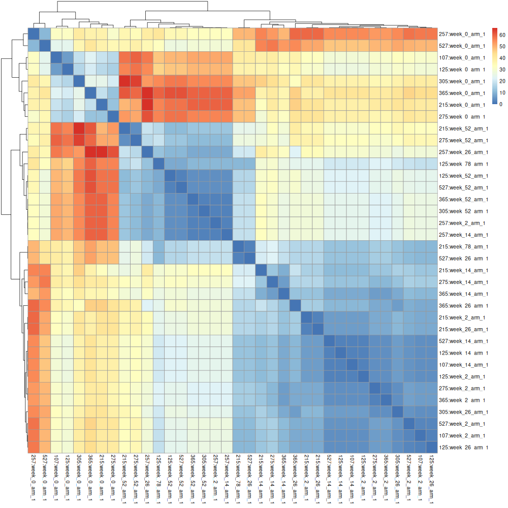

## Usage

=== "Command-line"

    When using the `pheno-ranker` command-line interface, simply ensure the [correct syntax](https://github.com/cnag-biomedical-informatics/pheno-ranker#synopsis) is provided.

    ```
    ./pheno-ranker -r individuals.json 

    ```

    This will create a `matrix.txt` file that then can be processed to obtain a heatmap:

    --8<-- "tbl/rank.md"

     The matrix can be processed to obtain a heatmap:

    ```R
    # Load library
    library("pheatmap")

    # Read in the input file as a matrix
    data <- as.matrix(read.table("matrix.txt", header = TRUE, row.names = 1))

    # Save image
    png(filename = "heatmap.png", width = 1000, height = 1000,
        units = "px", pointsize = 12, bg = "white", res = NA)

    # Create the heatmap with row and column labels
    pheatmap(data)
    ```

    <figure markdown>
       { width="400" }
       <figcaption> Heatmap of a intra-cohort pairwise comparison</figcaption>
    </figure>


    The same matrix can be processed with multidimensional scaling to reduce teh dimensionality

    ```R
    library(ggplot2)
    library(ggrepel)
    
    # Read in the input file as a matrix 
    data <- as.matrix(read.table("matrix.txt", header = TRUE, row.names = 1))
    
    #calculate distance matrix
    d <- dist(data)
    
    #perform multidimensional scaling
    fit <- cmdscale(d, eig=TRUE, k=2)
    
    #extract (x, y) coordinates of multidimensional scaling
    x <- fit$points[,1]
    y <- fit$points[,2]
    
    # Create example data frame
    df <- data.frame(x, y, label=row.names(data))
    
    # Save image
    png(filename = "mds.png", width = 1000, height = 1000,
        units = "px", pointsize = 12, bg = "white", res = NA)
    
    # Create scatter plot
    ggplot(df, aes(x, y, label = label)) +
      geom_point() +
      geom_text_repel(size = 5, # Adjust the size of the text
                      box.padding = 0.2, # Adjust the padding around the text
                      max.overlaps = 10) + # Change the maximum number of overlaps
      labs(title = "Multidimensional Scaling Results",
           x = "Hamming Distance MDS Coordinate 1",
           y = "Hamming Distance MDS Coordinate 2") + # Add title and axis labels
      theme(
            plot.title = element_text(size = 30, face = "bold", hjust = 0.5),
            axis.title = element_text(size = 25),
            axis.text = element_text(size = 15))
    ```

    <figure markdown>
       { width="400" }
       <figcaption> Mulsidomensional scaling of a intra-cohort pairwise comparison</figcaption>
    </figure>


=== "Module"

    The concept is to pass the necessary information as a hash (in Perl) or dictionary (in Python).

    === "Perl"

        ```Perl
        $data = {
            reference_file => './individuals.json',
            output => 'matrix.txt'
        };
        ```

    === "Python"

        ```Python
        data = {
             "reference_file" : "./individuals.json",
             "output" : "matrix.txt"
        }
        ```
