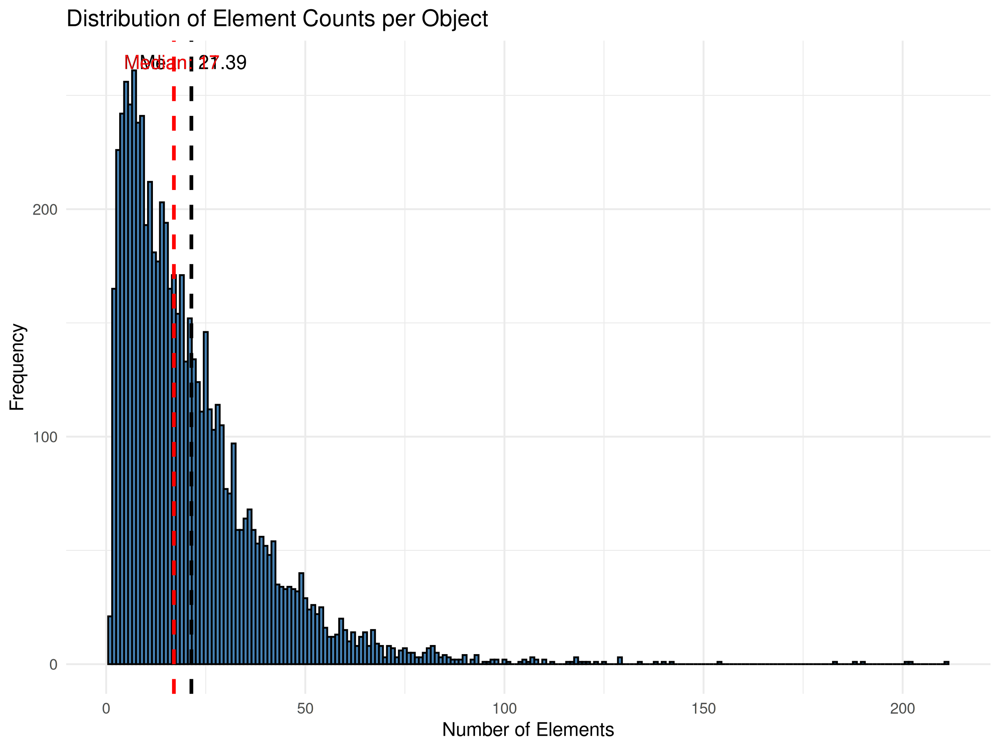
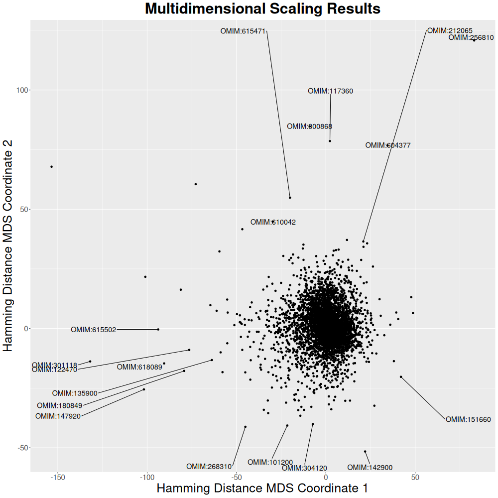

# Using `Pheno-Ranker` with OMIM Data

This guide explains how to use `Pheno-Ranker` with data from the [OMIM Database](https://omim.org).

## Data Download

Starting from version **1.02**, `Pheno-Ranker` includes **disease-based** cohorts: one for the [OMIM Database](https://omim.org) and another for the [ORPHAnet Database](https://www.orpha.net/).

For more details on how these cohorts were created, refer to [this repository](https://github.com/CNAG-Biomedical-Informatics/pheno-ranker/tree/main/share/diseases/hpo/). If you use this data in your research, please check the citation section.

!!! Hint "Additional disease-based cohorts"
    In addition to the **OMIM** cohort in `BFF` format, we also provide an **ORPHA** cohort.

If you installed the code via GitHub or Docker, the disease-based cohorts should already be available. Otherwise, follow these steps to download them. Ensure that `wget` and `jq` are installed:

```bash
sudo apt install wget jq
```

We assume that you have `R` installed and can install its required packages.

```bash
wget https://raw.githubusercontent.com/CNAG-Biomedical-Informatics/pheno-ranker/refs/heads/main/share/diseases/hpo/omim.pxf.json.gz
```

Here, we will use the `PXF` version of the disease-based cohort.

## Analytics

```bash
zcat omim.pxf.json.gz | jq 'length'
```

The cohort consists of **6,471** diseases. Each disease is represented as a `PXF` containing a list of `phenotypicTerms`.

From this point onward, we assume that the `pheno-ranker` directory is located at `../`. Please adjust the path accordingly.

To analyze the distribution of terms across patients, we will use a `Perl` script.

??? Example "See Perl code"
    ```perl
    --8<-- "scripts/count_phenotypicFeatures.pl"
    ```

```bash
zcat omim.pxf.json.gz | ./count_phenotypicFeatures.pl > counts.csv
```

Now, we will use `R` to plot a histogram.

??? Example "See R code"
    ```r
    --8<-- "scripts/histogram.R"
    ```

???+ Example "Display plot"

    <figure markdown>
     { width="600" }
    </figure>

Based on the median, the **Completeness** of the [Phenopackets Corpus](phenopackets-corpus.md) is approximately **71%** (12/17).

## Cohort Mode

We begin with a simple calculation using the **Jaccard** index. We also export intermediate files using `--e omim` for later use. From now on, we will focus on `phenotypicFeatures` terms, which we aim to use for patient classification.

Ensure that the `pheno-ranker` directory is set correctly.

```bash
time ../pheno-ranker/bin/pheno-ranker -r omim.pxf.json.gz --include-terms phenotypicFeatures --matrix-storage-threshold 10000 -e omim
```

This calculation takes approximately **2.5 minutes** (1 core @ Apple M2 Pro). The `--matrix-storage-threshold 10000` flag increases efficiency by using RAM, making the process **2x faster**.

Since a **6,471 × 6,471** matrix is too large for a heatmap, we will use **multidimensional scaling** (`mds.R` script).

```bash
Rscript ../pheno-ranker/share/r/mds.R
```

This computation takes about **5 minutes** (1 core @ Apple M2 Pro).

??? Example "See R code"
    ```r
    --8<-- "https://raw.githubusercontent.com/CNAG-Biomedical-Informatics/pheno-ranker/main/share/r/mds.R"
    ```

???+ Example "Display plot"

    <figure markdown>
     { width="600" }
    </figure>

```bash
../pheno-ranker/bin/pheno-ranker -r combined.json -include-terms phenotypicFeatures
Rscript ../pheno-ranker/share/r/mds.R
```

### Graph Representation

To generate a graph visualization, we use a subset of **50 diseases** for faster execution.

```bash
zcat omim.pxf.json.gz | jq -c '.[]' | shuf -n 50 | jq -s '.' > omim_small.json
../pheno-ranker/bin/pheno-ranker -r omim_small.json -include-terms phenotypicFeatures --cytoscape-json omim_cytoscape.json
``` 

???+ Example "Display plot"

     <div id="cy3" style="width: 100%; height: 500px; border: 1px solid black;"></div>

     <script>
       document.addEventListener("DOMContentLoaded", function () {
         const repoName = "pheno-ranker"; // Change this if needed
         loadCytoscapeGraph("cy3", "/data/omim_cytoscape.json", repoName, 50);
       });
     </script>

## Patient Mode

We will attempt to match patient `PMID_35344616_A2` from the [Phenopackets Corpus](phenopackets-corpus.md) to its disease (OMIM:268310) in **OMIM**. See the [Phenopackets Corpus](phenopackets-corpus.md) tutorial for instructions on obtaining a `PXF` file for the patient.

Sorting by **Jaccard** index is recommended, as data **completeness** is below 30%. From the top three, selecting by **INTERSECT-RATE(%)** ranks the match at **#1**.

```bash
../pheno-ranker/bin/pheno-ranker -r omim.pxf.json.gz -t PMID_35344616_A2.json -include-terms phenotypicFeatures -sort-by jaccard -max-out 5
```

???+ Example "See Results"
    --8<-- "tbl/omim_PMID_35344616_A2.md"

This process takes **~30 seconds**. For a much faster approach using **precomputed data**, run:

```bash
../pheno-ranker/bin/pheno-ranker -prp omim -t PMID_35344616_A2.json -include-terms phenotypicFeatures -sort-by jaccard -max-out 5
```

With **precomputed data**, the calculation takes only **7 seconds** while yielding identical results.

## Citation

If you use this information in your research, please cite the following:

1.	[HPO Citation](https://doi.org/10.1093/nar/gkad1005).
2.	[Phenopacket Corpus](https://www.cell.com/hgg-advances/fulltext/S2666-2477(24)00111-8).
3.	[Pheno-Ranker publication](https://bmcbioinformatics.biomedcentral.com/articles/10.1186/s12859-024-05993-2).
