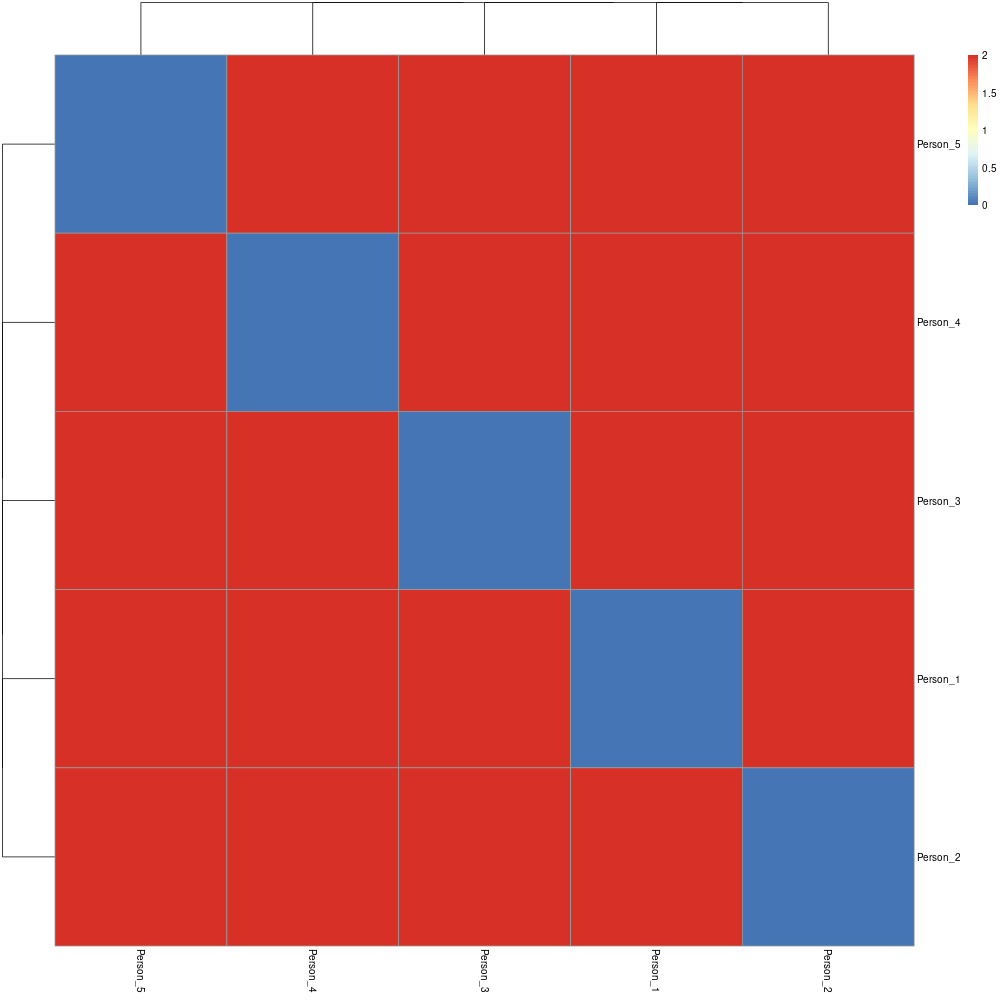

# Processing OpenEHR files

!!! Bug "Experimental"
    Please note: This page features experimental content, and we are not experts in openEHR. Proceed at your own risk.

<figure markdown>
 { width="300" }
 <figcaption> Image from https://openehr.org</figcaption>
</figure>

**openEHR** is an open standard for electronic health records (EHRs), ensuring consistency and interoperability in medical data across healthcare systems. It uses a dual-level structure: a base model and customizable templates for various medical scenarios. When represented as JSON, openEHR data maintains its hierarchical form, using objects and key-value pairs to depict healthcare data and metadata, enabling compatibility across diverse healthcare applications.


???+ Question "Where does your openEHR `JSON` data come from?"

    Finding `JSON` examples can be challenging. For this demonstration, we'll use sample data from this helpful [publication](https://www.sciencedirect.com/science/article/pii/S1532046423001582?via%3Dihub).

    Citation:

    Kohler S, Boscá D, Kärcher F, Haarbrandt B, Prinz M, Marschollek M, Eils R. _Eos and OMOCL: Towards a seamless integration of openEHR records into the OMOP Common Data Model_. J Biomed Inform. 2023 Aug;144:104437. doi: 10.1016/j.jbi.2023.104437. Epub 2023 Jul 12. PMID: 37442314.

This is how their data `person_data_v0.json` ([source](https://github.com/SevKohler/Eos/tree/main/src/test/java/json/output)) looks like:

??? Example "JSON data"

    ```bash
    [
      {
        "id": "##ignore",
        "person": "##ignore",
        "visitConcept": {
          "id": "##ignore",
          "conceptName": "Inpatient Visit",
          "domainId": "Visit",
          "vocabularyId": "Visit",
          "conceptClassId": "Visit",
          "standardConcept": "S",
          "conceptCode": "IP",
          "validStartDate": "1969-12-31T23:00:00.000+00:00",
          "validEndDate": "2099-12-30T23:00:00.000+00:00",
          "invalidReason": null,
          "idAsLong": "##ignore"
        },
        "visitStartDate": "2020-09-30T22:00:00.000+00:00",
        "visitStartDateTime": "2020-09-30T22:00:00.000+00:00",
        "visitEndDate": "2020-09-30T22:00:00.000+00:00",
        "visitEndDateTime": "2020-09-30T22:00:00.000+00:00",
        "visitTypeConcept": {
          "id": "##ignore",
          "conceptName": "EHR",
          "domainId": "Type Concept",
          "vocabularyId": "Type Concept",
          "conceptClassId": "Type Concept",
          "standardConcept": "S",
          "conceptCode": "OMOP4976890",
          "validStartDate": "2020-08-19T22:00:00.000+00:00",
          "validEndDate": "2099-12-30T23:00:00.000+00:00",
          "invalidReason": null,
          "idAsLong": "##ignore"
        },
        "provider": null,
        "careSite": null,
        "visitSourceValue": null,
        "visitSourceConcept": null,
        "admittedFromConcept": {
          "id": "##ignore",
          "conceptName": "No matching concept",
          "domainId": "Metadata",
          "vocabularyId": "None",
          "conceptClassId": "Undefined",
          "standardConcept": null,
          "conceptCode": "No matching concept",
          "validStartDate": "1969-12-31T23:00:00.000+00:00",
          "validEndDate": "2099-12-30T23:00:00.000+00:00",
          "invalidReason": null,
          "idAsLong": "##ignore"
        },
        "admittedFromSourceValue": null,
        "dischargedToConcept": {
          "id": "##ignore",
          "conceptName": "No matching concept",
          "domainId": "Metadata",
          "vocabularyId": "None",
          "conceptClassId": "Undefined",
          "standardConcept": null,
          "conceptCode": "No matching concept",
          "validStartDate": "1969-12-31T23:00:00.000+00:00",
          "validEndDate": "2099-12-30T23:00:00.000+00:00",
          "invalidReason": null,
          "idAsLong": "##ignore"
        },
        "dischargedToSourceValue": null,
        "precedingVisitOccurrence": null,
        "idAsLong": "##ignore"
      }
    ]
    
    ```

For simplicity, we'll use the term `id` in place of `primary_key`, aligning with the default configuration.

Next, we'll replace it with an actual `id` (`Person_X`) and replicate the object five times to create an array with five individuals.

### Running `Pheno-Ranker`

=== "Intra-catalog comparison"

    ## Example 1: Using all terms

    ```bash
    pheno-ranker -r open_ehr.json
    ```

    The result is a file named `matrix.txt`. Find below the result of the clustering with `R`.

    <figure markdown>
      { width="600" }
      <figcaption> Intra-cohort pairwise comparison</figcaption>
    </figure>

     You get the concept :smile:. Altering the values will consequently change the distances.

    ## Example 2: Using a configuration file

    Let's create a configuration file for this data:

    ```yaml
    ---
    format: openEHR

    # Set the allowed terms / properties
    allowed_terms: [admittedFromConcept,admittedFromSourceValue,careSite,dischargedToConcept,dischargedToSourceValue,id,idAsLong,person,precedingVisitOccurrence,provider,visitConcept,visitEndDate,visitEndDateTime,visitSourceConcept,visitSourceValue,visitStartDate,visitStartDateTime,visitTypeConcept]
    ```

    Save the contents in a file named `open_ehr_config.yaml`. Now you can exclude or include terms:

    ```bash
    pheno-ranker -r open_ehr.json --config open_ehr_config.yaml --exclude-terms id
    ```

=== "Patient matching"

    ```bash
    pheno-ranker -r open_ehr.json -t person_data_v0.json --config open_ehr_config.yaml
    ```

    This will output the results to the console and additionally save them in a file titled `rank.txt`.

    --8<-- "tbl/rank-open-ehr.md"
