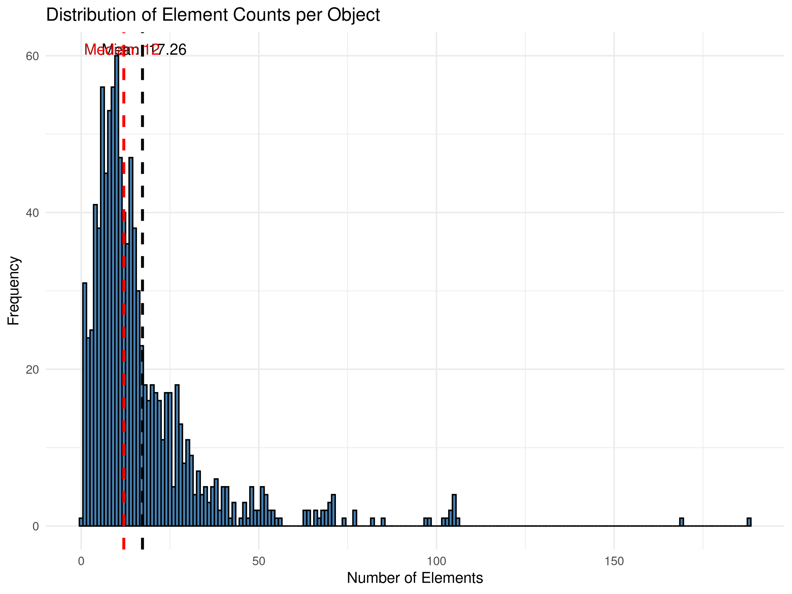

Here we will describe how to use `Pheno-Ranker` with the data from the recently published [Phenopacket Corpus](https://www.cell.com/hgg-advances/fulltext/S2666-2477(24)00111-8).

# Data Download

We will download the data from their GitHub repository (BSD3 open-source license). If you don't have `wget`, `dos2unix`, and `jq`, please install them using:

```bash
sudo apt install wget dos2unix jq
```

We assume that you have `R` installed and are capable of installing its required modules.

```bash
wget https://github.com/monarch-initiative/phenopacket-store/releases/latest/download/all_phenopackets.zip
unzip all_phenopackets.zip 
dos2unix */*/*.json
```

As this is an exercise, instead of using all `PXF` files, we will randomly select 1000 and create a JSON array file named `combined.json`:

```bash
jq -s '.' $(ls -1 */*/*.json | shuf -n 1000) > combined.json
```

??? Note "About reproducibility"

    We used `0.1.20`. You can reproduce this example with the folowing list of files:

    ```bash
    --8<-- "data/combined.txt"
    ```

# Analytics

We will use the utility `bff-pxf-plot` to gather some general statistics. 

From now on, we assume that you can find the `pheno-ranker` directory at `../`. Please replace it with the correct path.

```bash
../pheno-ranker/utils/bff_pxf_plot/bff-pxf-plot -i combined.json
```

??? Example "Display plot"

    <figure markdown>
     { width="600" }
    </figure>

## Cohort Mode

Let's start with a simple calculation.

```bash
../pheno-ranker/bin/pheno-ranker -r combined.json
```

Since a heatmap won't work for a 1000 x 1000 matrix, we'll perform multidimensional scaling using the `matrix.txt` results.

```bash
Rscript ../pheno-ranker/share/r/mds.R
```

??? Example "See R code"
    ```R
    --8<-- "https://raw.githubusercontent.com/CNAG-Biomedical-Informatics/pheno-ranker/main/share/r/mds.R"
    ```

???+ Example "Display plot"

    <figure markdown>
     { width="600" }
    </figure>

From now on, we will focus on the `phenotypicFeatures` term, as ideally, we would like to use them to classify patients.

```bash
../pheno-ranker/bin/pheno-ranker -r combined.json -include-terms phenotypicFeatures
Rscript ../pheno-ranker/share/r/mds.R
```

???+ Example "Display plot"
    <figure markdown>
     { width="600" }
    </figure>


Now, let's examine the distribution of terms across patients. There are many ways to do this, but here we will a `Perl`script.

??? Example "See Perl code"
    ```perl
    --8<-- "scripts/count_phenotypicFeatures.pl"
    ```
Now, we will use `R` to plot a histogram.

??? Example "See R code"
    ```R
    --8<-- "scripts/histogram.R"
    ```

???+ Example "Display plot"

    <figure markdown>
     { width="600" }
    </figure>

### Colored by Disease

We will use `Pheno-Ranker` output to fetch the diseases so that we can color the MDS plot. We will use  the `-e` option, which exports intermediate files. Let's start by running a job:

```bash
../pheno-ranker/bin/pheno-ranker -r combined.json -include-terms diseases -e
mv export.ref_hash.json diseases_info.json
```

Now we have the disease information stored in `diseases_info.json`.

We will use `R` to plot by disease:

??? Example "See R code"
    ```R
    --8<-- "scripts/histogram.R"
    ```

???+ Example "Display plot"

    <figure markdown>
     { width="600" }
    </figure>

### Graph

We will create a graph but we will be using only data from 50 patients to make it faster.

```bash
jq -c '.[]' combined.json | shuf -n 50 | jq -s '.' > combined_small.json
../pheno-ranker/bin/pheno-ranker -r combined_small.json -include-terms phenotypicFeatures --cytoscape-json corpus_cytoscape.json
``` 

???+ Example "Display plot"

     <div id="cy1" style="width: 100%; height: 500px; border: 1px solid black;"></div>

     <script>
       document.addEventListener("DOMContentLoaded", function () {
         const repoName = "pheno-ranker"; // Change this if needed
         loadCytoscapeGraph("cy1", "/data/corpus_cytoscape.json", repoName, 50);
       });
     </script>

## Patient Mode

Now, we will choose patient `PMID_35344616_A2` to search for similar patients. We already know from the figures above that this patient is related to at least three other patients.

First, we will perform a dry run to obtain the `JSON` for that individual.

```bash
../pheno-ranker/bin/pheno-ranker -r combined.json -poi PMID_35344616_A2
```

This will create the file `PMID_35344616_A2.json`.

Now, we run it in **patient** mode.

```bash
../pheno-ranker/bin/pheno-ranker -r combined.json -t PMID_35344616_A2.json -include-terms phenotypicFeatures -max-out 5
```

???+ Example "See Results"
    --8<-- "tbl/PMID_35344616_A2.md"

There might be cases where you want to retain `phenotypicFeatures` set to `"excluded": true`. For instance, when you want to match individuals with the same diseases but lacking some features. Use `--retain-excluded-phenotypicFeatures` for that.

# Citation

Please if you find use any ot this information for your research please cite:

1.	[Phenopacket Corpus](https://www.cell.com/hgg-advances/fulltext/S2666-2477(24)00111-8). 

2.	[Pheno-Ranker publication](https://bmcbioinformatics.biomedcentral.com/articles/10.1186/s12859-024-05993-2).

