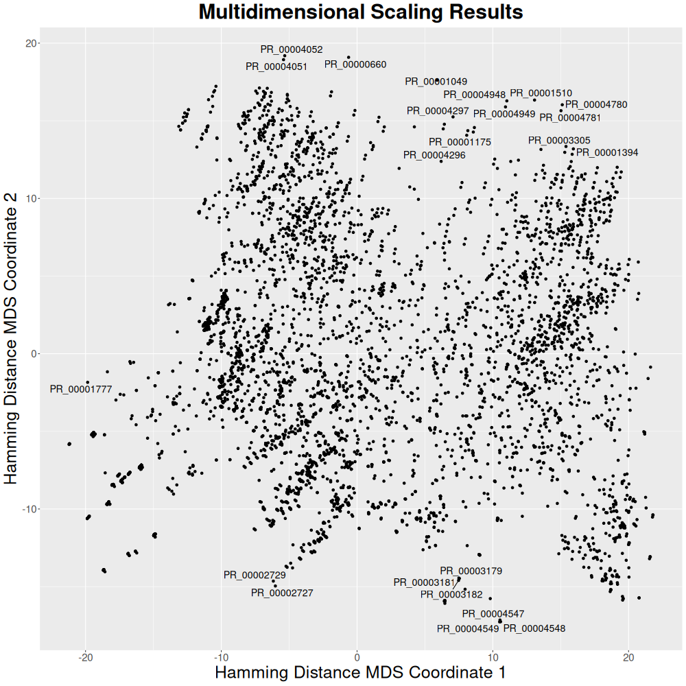

# Using `Pheno-Ranker` with TCGA Clinical Data

This guide explains how to use `Pheno-Ranker` with data from [TCGA](https://portal.gdc.cancer.gov), obtained via the **Genomic Data Commons Data Portal**.

!!! Warning "About this example"

    This example demonstrates how to process and use the data. It is not intended to yield relevant scientific conclusions.
 
## Data Download

1. We are going to perform a data download by visiting the following link: [Cohort Builder](https://portal.gdc.cancer.gov/analysis_page?app=CohortBuilder&tab=general)

2. In Project, select a few named **TCGA**. Then click in "CASES" and switch to **Table View**. 

3. Next, click in **TSV** to download the data. You will likely end up with a file like: `clinical.cohort.2025-06-02.tar.gz`.

```bash
# Change the filename to match yours!
tar -xvf clinical.cohort.2025-06-02.tar.gz
```

The file we will use is `clinical.tsv`.

??? Hint "Why `TSV` and not `JSON`?"

    `Pheno-Ranker` works natively with `JSON`, so you *could* download JSON data. However, since the data often contains 2D-nested arrays, for this example it's easier to stick with `TSV`. The only caveat is that in the TSV, instead of all case-level data being consolidated into one object, we may have multiple rows per `"case_id"`. Just be aware of that.

4. If you didn't select a specific cohort, you will end up with a TSV covering >45K cases and >100K rows. That might be a bit too much, so we will downsample to ~5K cases and replace empty values (and not reported) with "NA":

```bash
head -5001 clinical.tsv |sed -e "s/'--/NA/g" -e 's/no[tn] reported/NA/ig' > clinical_filtered.tsv

```

5. Now we will convert the TSV to a format ready for `Pheno-Ranker`, using the `csv2pheno-ranker` utility. Since the primary key `case_id` appears multiple times, we will generate a new primary key so the objects don't overwrite each other:

```bash
# Please change the path to match yours
../pheno-ranker/utils/csv2pheno_ranker/csv2pheno-ranker -i clinical_filtered.tsv --generate-primary-key --primary-key-name id -sep $'\t'
```

This will create two files:

```bash
clinical_filtered.json
clinical_filtered_config.yaml
```

## Cohort Mode

We will begin with a simple calculation in **cohort** mode. In this run, we will also export intermediate files using `--e tcga` for later use.

Ensure that the `pheno-ranker` directory is set correctly:

```bash
time ../pheno-ranker/bin/pheno-ranker -r clinical_filtered.json -e tcga -config clinical_filtered_config.yaml --max-matrix-records-in-ram 10000
```

This calculation takes approximately **1:15 min** (1 core on an Apple M2 Pro). The `--max-matrix-records-in-ram 10000` flag improves efficiency by utilizing RAM, making the process about **2x faster**.

Feel free to browse the miscellaneous data created as `tcga*`.

Since we have many variables that provide no value, we will add the following line to `clinical_filtered_config.yaml`. You can check which variables are used in `tcga.glob_hash.json`.

Simply open `clinical_filtered_config.yaml` with your favorite text editor and add:

```yaml
# Set the regex to exclude variables matching a specific pattern
exclude_variables_regex: 'datetime|days_to_|cases.case_id|cases.submitter_id|demographic.demographic_id|demographic.submitter_id|diagnoses.diagnosis_id|diagnoses.submitter_id|project.project_id|treatments.protocol_identifier|treatments.submitter_id|treatments.treatment_id|age_of|treatment_dose|age_at|year_of_birth'
```

!!! Warning "Quantitative data"

    In this exercise, we have decided to get rid of numerical data. In a real example, we would have created **bins for quantitative variables**.

Now run the calculation again:

```bash
time ../pheno-ranker/bin/pheno-ranker -r clinical_filtered.json -e tcga -config clinical_filtered_config.yaml --max-matrix-records-in-ram 10000  --exclude-terms id
```

Since a **5,000 x 5,000** matrix is too large for a heatmap, we will use **multidimensional scaling** (`mds.R` script):

```bash
Rscript ../pheno-ranker/share/r/mds.R
```

This computation takes about **2:20 min** (1 core on an Apple M2 Pro).

??? Example "See R code"
    ```r
    --8<-- "https://raw.githubusercontent.com/CNAG-Biomedical-Informatics/pheno-ranker/main/share/r/mds.R"
    ```

???+ Example "Display plot"

    <figure markdown>
    { width="600" }
    </figure>

## Patient Mode

Now we will attempt to match a given patient from the dataset to the rest. To do this:

```bash
../pheno-ranker/bin/pheno-ranker -r clinical_filtered.json -patients-of-interest PR_00000001
```

This will create the file `PR_00000001.json`.

Sorting by **Jaccard** index is recommended, since data **completeness** may be below 30%.

```bash
time ../pheno-ranker/bin/pheno-ranker -r clinical_filtered.json -t PR_00000001.json --config clinical_filtered_config.yaml -sort-by jaccard -max-out 5 --exclude-terms id
```

???+ Example "See Results"
    --8<-- "tbl/tcga-clinical.md"

Let's take a look to the **alignment** related file. For this we will re-run but this time using the flag `--align`:

```bash
../pheno-ranker/bin/pheno-ranker -r clinical_filtered.json -t PR_00000001.json --config clinical_filtered_config.yaml -sort-by jaccard -max-out 5 --exclude-terms id --align
```

Feel free to browse `align*` files.

This is what looked like in my case for Rank 2 (yours may be different).

```yaml
PR_00000001: 
  "cases.case_id" : "00016c8f-a0be-4319-9c42-4f3bcd90ac92"
PR_00000906: 
  "cases.case_id" : "01b7e692-d0cf-462f-9bbf-3ddb1572d025"
```

Inside `alignment.txt` (note that I omitted lines wth this pattern `/^0 ----- 0 |/`)

```bash
#RANK   REFERENCE(ID)   TARGET(ID)  FORMAT  LENGTH  WEIGHTED    HAMMING-DISTANCE    DISTANCE-Z-SCORE    DISTANCE-P-VALUE    DISTANCE-Z-SCORE(RAND)  JACCARD-INDEX   JACCARD-Z-SCORE JACCARD-P-VALUE REFERENCE-VARS  TARGET-VARS INTERSECT   INTERSECT-RATE(%)   COMPLETENESS(%) 
2   PR_00000906 PR_00000001 CSV      8  False      1     -2.810    0.0024794     -2.1213      0.875   9.549    0.0000000         7       8       7     87.50      100.00
--------------------------------------------------------------------------------
REF -- TAR
1 ----- 1 | (w:  1|d:  0|cd:  0|) cases.disease_type.Epithelial Neoplasms, NOS (Epithelial Neoplasms, NOS)
1 ----- 1 | (w:  1|d:  0|cd:  0|) cases.primary_site.Breast (Breast)
1 ----- 1 | (w:  1|d:  0|cd:  0|) demographic.gender.female (female)
1 ----- 1 | (w:  1|d:  0|cd:  0|) diagnoses.classification_of_tumor.metastasis (metastasis)
1 ----- 1 | (w:  1|d:  0|cd:  0|) diagnoses.morphology.8010/3 (8010/3)
1 ----- 1 | (w:  1|d:  0|cd:  0|) diagnoses.primary_diagnosis.Carcinoma, NOS (Carcinoma, NOS)
0 --xxx 1 | (w:  1|d:  1|cd:  1|) diagnoses.site_of_resection_or_biopsy.Thorax, NOS (Thorax, NOS)
1 ----- 1 | (w:  1|d:  0|cd:  1|) diagnoses.tissue_or_organ_of_origin.Breast, NOS (Breast, NOS)
```

## Citation

If you use this information in your research, please cite the following:

1. The results shown here are in whole or in part based upon data generated by the TCGA Research Network: https://www.cancer.gov/tcga
2. [Pheno-Ranker publication](https://bmcbioinformatics.biomedcentral.com/articles/10.1186/s12859-024-05993-2).
