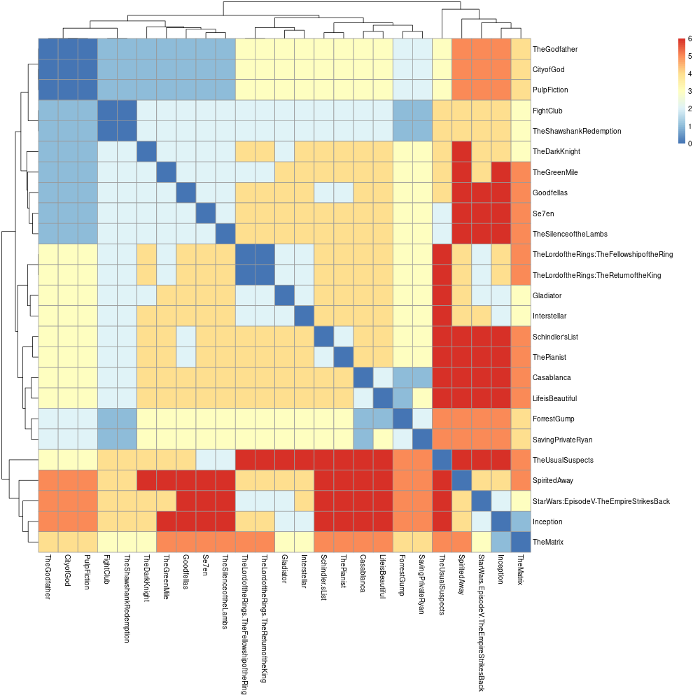
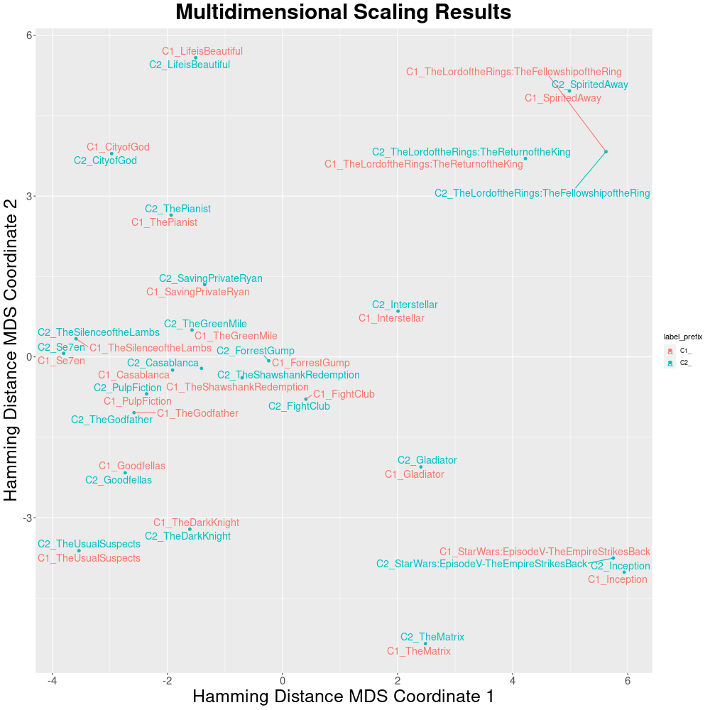

!!! th Tip "Google Colab version"
    We created a [Google Colab version](https://colab.research.google.com/drive/1n3Etu4fnwuDWNveSMb1SzuN50O2a05Rg#scrollTo=8tbJ0f5-hJAB) of the tutorial. Users can view notebooks shared publicly without sign-in, but you need a google account to execute code.

    We also have a local copy of the notebook that can be downloaded from the [repo](https://github.com/CNAG-Biomedical-Informatics/pheno-ranker/blob/main/nb/convert_pheno_cli_tutorial.ipynb). 

This page provides brief tutorials on how to perform data conversion by using `Pheno-Ranker`**command-line interface**.

!!! Info "Note on installation"
    Before proceeding, ensure that the software is properly installed. In the following instructions, it will be assumed that you have downloaded and installed the [containerized version](https://github.com/CNAG-Biomedical-Informatics/pheno-ranker#containerized-recommended-method).

### Moviepackets:

For the tutorial we will use the format **Moviepackets** to demonstrate the power of `Pheno-Ranker` with any JSON file.

!!! Question "What is a Moviepacket (MXF) file?"
    A Moviepacket is an invented format :smile: designed to describe movies, analogous to Phenopackets v2 used for pheno-clinical data.


Imagine you have a catalog of 25 movies described in JSON format. Each movie has several `properties` (a.k.a. `terms`).

```bash
[
  {
    "title": "TheShawshankRedemption",
    "genre": [
      "Drama"
    ],
    "year": 1994,
    "country": "USA",
    "rating": 9.3
  },
  {
    "title": "TheGodfather",
    "genre": [
      "Crime",
      "Drama"
    ],
    "year": 1972,
    "country": "USA",
    "rating": 9.2
  },...
]
```

You are interested in checking the variety of your catalog and plan to use `Pheno-Ranker`. The first thing that we are going to create is a configuration file.

!!! Question "What is a `Pheno-Ranker` configuration file?"
    A configuration file is a text file in [YAML](https://en.wikipedia.org/wiki/YAML) format ([JSON](https://en.wikipedia.org/wiki/JSON) is also accepted) that serves to initialize some variables. It is particularly important when you are not using the two supported formats _out-of-the-box_ that are [BFF](bff.md) and [PXF](pxf.md).

### Creating a configuration file

To create a configuration file, start by reviewing the [example file](https://github.com/cnag-biomedical-informatics/pheno-ranker/blob/main/t/movie_config.yaml) provided with the installation. The goal is to replace the contents of such file with those from your project. If your movies did not have array-based properties the configuration file will look like this:

```bash
# Set the format
format: MXF # Optional when no array-based properties

# Set the primary key for the objects
primary_key: title

# Set the allowed terms / properties
allowed_terms: [country,genre,year]
```

But because your data has the term `genre`, which is an `array` the file will look like this:

```bash
# Set the format
format: MXF

# Set the primary key for the objects
primary_key: title

# Set the allowed terms / properties
allowed_terms: [country,genre,year]

# Set the terms which are arrays
array_terms: [genre]

# Set the regex to perform the substitution in array elements
array_regex: '^(\w+):(\d+)'

# Set the path for array properties
id_correspondence:
  MXF:
    genre: genre
```

In the table below we show which parameters are needed depending on the format:

| Format      | Required properties | Optional properties | Pre-configured |
| ----------- | ------------------- | ------------------- |  -----  | 
| BFF / PXF   | `primary_key, allowed_terms, array_terms, array_regex, id_correspondence` | `format` | ✓ |
| Others (`array`) | `format, primary_key, allowed_terms, array_terms, id_correspondence` | `array_regex` |   |
| Others (`non-array`) |  `primary_key, allowed_terms` | `format` |   |


 * Where:
    - **format**, is a `string` that defines your particular format. In this case `MXF`. Note that it has to match that of `id_correspondence`.
    - **primary_key**, the key that will be used as an item identifier.
    - **allowed_terms**, is an `array` to define the terms that can be used with the flags `--include-terms` and `--exclude-terms`.
    - **array_terms**, is an `array` to enumerate which properties are arrays.
    - **array_regex**, it's an `string` to define how the flattened JSON array elements will be renamed.
    - **id_correspondence**, is a nested `object` that maps the actual JSON path to a given array element.

!!! Tip "Do I need to create a configuration file?"
    This file only has to be created if you are working with **your own JSON format**. 

    If your format is similar to that to Moviepackets just use that file, making sure you change the `allowed_terms` to match yours.

### Running `Pheno-Ranker`

Once you have created the mapping file you can proceed to run `pheno-ranker` with the **command-line interface**.

=== "Intra-catalog comparison"

    ## Example 1: Let's start by using all terms

    `bin/pheno-ranker -r t/movies.json --config t/movies_config.yaml`

    The result is a file named `matrix.txt`. Find below the result of the clustering with `R`.

    !!! Abstract "Included R scripts"

        You can find in the link below a few examples to perform clustering and multimensional scaling with your data:

        [R scripts at GitHub](https://github.com/CNAG-Biomedical-Informatics/pheno-ranker/tree/main/share/r).

    <figure markdown>
      { width="600" }
      <figcaption> Intra-cohort pairwise comparison</figcaption>
    </figure>

    ## Example 2: Let's cluster by year

    `bin/pheno-ranker -r t/movies.json --include-terms year --config t/movies_config.yaml`

    <figure markdown>
      { width="600" }
      <figcaption> Intra-cohort pairwise comparison</figcaption>
    </figure>

    ## Example 3: Let's cluster by `genre`

    `bin/pheno-ranker -r t/movies.json --include-terms genre --config t/movies_config.yaml`

    <figure markdown>
       { width="600" }
       <figcaption> Intra-cohort pairwise comparison</figcaption>
    </figure>

    ## Example 4: Let's apply weights to `genre`

    We will use the file `t/movies_weigths.yaml` that has the following content:

    ```yaml
    ---
    genre.Biography: 25
    ```

    `bin/pheno-ranker -r t/movies.json --include-terms genre --w t/movies_weigths.yaml --config t/movies_config.yaml`

    <figure markdown>
      { width="600" }
      <figcaption> Intra-cohort pairwise comparison</figcaption>
    </figure>

=== "Inter-catalog comparison"

    Imagine you have several **MoviePacket** :smile: catalogs and you want to compare the similarity among them.

    The way you will compute this with `Pheno-Ranker` is similar to intra-catalog, the only thing to have in mind is that the catalogs (i.e., cohorts) will have a preffix so that we can identify them.

    ## Example 1: Default catalog (cohort) nomenclature 

    For demonstration purposes, in this example we are re-using the same file (`t/movies.json`)

    `bin/pheno-ranker -r t/movies.json t/movies.json --config t/movies_config.yaml`

    After executing this command you will obtain a file named `matrix.txt` which is a matrix consisting of all (25+25)*(25+25) pairwise comparisons.

    !!! Abstract "Dimensionality reduction"
        We will use the included [R scripts]((https://github.com/CNAG-Biomedical-Informatics/pheno-ranker/tree/main/share/r)) to perform dimensionality reduction via [MDS](https://en.wikipedia.org/wiki/Multidimensional_scaling). Note that you can use other dimensioanly reduction techniques such as t-SNE or UMAP.

    <figure markdown>
      { width="600" }
      <figcaption> Inter-catalog multidimensional scaling</figcaption>
    </figure>


    By default, the ids in each catalog will be renamed to C1_, C2_ and so on, but you can add your own preffixes with `--append-prefix`.

    ## Example 2: Set up catalog nomenclature prefixes 

    `bin/pheno-ranker -r t/movies.json t/movies.json t/movies.json --append-prefixes NETFLIX HBO PRIME_VIDEO --config t/movies_config.yaml`

    <figure markdown>
      { width="600" }
      <figcaption> Inter-catalog multidimensional scaling</figcaption>
    </figure>

=== "Movie recommendations"

    Imagine you'd like to discover movies similar to a specific one, such as [Interstellar](https://en.wikipedia.org/wiki/Interstellar_(film)).

    ## Step 1: Isolate the Movie

    To single out the 'Interstellar' movie data:

    `bin/pheno-ranker -r t/movies.json --patient-of-interest Interstellar --config t/movies_config.yaml`

    This command will carry out a dry-run, producing an extracted JSON object named `Interstellar.json`.

    ```json
    {
       "country" : "USA",
       "genre" : [
          "Adventure",
          "Drama",
          "Sci-Fi"
       ],
       "rating" : 8.6,
       "title" : "Interstellar",
       "year" : 2014
    }
    ```
 

    ## Step 2: Rank Similar Movies

    Next, run the following command to initiate the ranking process:

    `bin/pheno-ranker -r t/movies.json -t Interstellar.json --config t/movies_config.yaml`

    This will output the results to the console and additionally save them in a file titled `rank.txt`.

    | RANK | REFERENCE(ID) | TARGET(ID) | FORMAT | LENGTH | WEIGHTED | HAMMING-DISTANCE | DISTANCE-Z-SCORE | DISTANCE-P-VALUE | DISTANCE-Z-SCORE(RAND) | JACCARD-INDEX | JACCARD-Z-SCORE | JACCARD-P-VALUE |
    | --- | --- | --- | --- | --- | --- | --- | --- | --- | --- | --- | --- | --- |
    | 1 | Interstellar | Interstellar | MXF |      7 | False |    0 |  -3.994 |    0.0000325 |  -2.6458 |   1.000 |   4.529 |    0.0002087 |
    | 2 | SavingPrivateRyan | Interstellar | MXF |     10 | False |    7 |  -0.846 |    0.1988972 |   1.2649 |   0.300 |   0.438 |    0.7129606 |
    | 3 | TheShawshankRedemption | Interstellar | MXF |     10 | False |    8 |  -0.396 |    0.3461273 |   1.8974 |   0.200 |  -0.146 |    0.8742001 |
    | 4 | Se7en | Interstellar | MXF |     11 | False |    8 |  -0.396 |    0.3461273 |   1.5076 |   0.273 |   0.279 |    0.7646809 |
    | 5 | Gladiator | Interstellar | MXF |     11 | False |    8 |  -0.396 |    0.3461273 |   1.5076 |   0.273 |   0.279 |    0.7646809 |
    | 6 | Inception | Interstellar | MXF |     11 | False |    8 |  -0.396 |    0.3461273 |   1.5076 |   0.273 |   0.279 |    0.7646809 |
    | 7 | FightClub | Interstellar | MXF |     10 | False |    8 |  -0.396 |    0.3461273 |   1.8974 |   0.200 |  -0.146 |    0.8742001 |
    | 8 | TheGreenMile | Interstellar | MXF |     11 | False |    8 |  -0.396 |    0.3461273 |   1.5076 |   0.273 |   0.279 |    0.7646809 |
    | 9 | TheSilenceoftheLambs | Interstellar | MXF |     11 | False |    8 |  -0.396 |    0.3461273 |   1.5076 |   0.273 |   0.279 |    0.7646809 |
    | 10 | ForrestGump | Interstellar | MXF |     11 | False |    9 |   0.054 |    0.5215214 |   2.1106 |   0.182 |  -0.253 |    0.8948480 |
    | 11 | TheMatrix | Interstellar | MXF |     11 | False |    9 |   0.054 |    0.5215214 |   2.1106 |   0.182 |  -0.253 |    0.8948480 |
    | 12 | CityofGod | Interstellar | MXF |     11 | False |    9 |   0.054 |    0.5215214 |   2.1106 |   0.182 |  -0.253 |    0.8948480 |
    | 13 | PulpFiction | Interstellar | MXF |     11 | False |    9 |   0.054 |    0.5215214 |   2.1106 |   0.182 |  -0.253 |    0.8948480 |
    | 14 | TheGodfather | Interstellar | MXF |     11 | False |    9 |   0.054 |    0.5215214 |   2.1106 |   0.182 |  -0.253 |    0.8948480 |
    | 15 | Goodfellas | Interstellar | MXF |     12 | False |   10 |   0.504 |    0.6927786 |   2.3094 |   0.167 |  -0.341 |    0.9100849 |
    | 16 | TheLordoftheRings:TheFellowshipoftheRing | Interstellar | MXF |     12 | False |   10 |   0.504 |    0.6927786 |   2.3094 |   0.167 |  -0.341 |    0.9100849 |
    | 17 | Casablanca | Interstellar | MXF |     12 | False |   10 |   0.504 |    0.6927786 |   2.3094 |   0.167 |  -0.341 |    0.9100849 |
    | 18 | Schindler'sList | Interstellar | MXF |     12 | False |   10 |   0.504 |    0.6927786 |   2.3094 |   0.167 |  -0.341 |    0.9100849 |
    | 19 | LifeisBeautiful | Interstellar | MXF |     12 | False |   10 |   0.504 |    0.6927786 |   2.3094 |   0.167 |  -0.341 |    0.9100849 |
    | 20 | SpiritedAway | Interstellar | MXF |     12 | False |   10 |   0.504 |    0.6927786 |   2.3094 |   0.167 |  -0.341 |    0.9100849 |
    | 21 | TheLordoftheRings:TheReturnoftheKing | Interstellar | MXF |     12 | False |   10 |   0.504 |    0.6927786 |   2.3094 |   0.167 |  -0.341 |    0.9100849 |
    | 22 | TheDarkKnight | Interstellar | MXF |     12 | False |   10 |   0.504 |    0.6927786 |   2.3094 |   0.167 |  -0.341 |    0.9100849 |
    | 23 | StarWars:EpisodeV-TheEmpireStrikesBack | Interstellar | MXF |     12 | False |   10 |   0.504 |    0.6927786 |   2.3094 |   0.167 |  -0.341 |    0.9100849 |
    | 24 | TheUsualSuspects | Interstellar | MXF |     13 | False |   12 |   1.403 |    0.9197335 |   3.0509 |   0.077 |  -0.866 |    0.9689622 |
    | 25 | ThePianist | Interstellar | MXF |     13 | False |   12 |   1.403 |    0.9197335 |   3.0509 |   0.077 |  -0.866 |    0.9689622 |

    Of course you can perform tha ranking against multiple cohorts and select specific terms.

    `bin/pheno-ranker -r t/movies.json t/movies.json --append-prefixes NEFLIX HBO -t Interstellar.json --include-terms genre year --config t/movies_config.yaml --max-out 10`


    | RANK | REFERENCE(ID) | TARGET(ID) | FORMAT | LENGTH | WEIGHTED | HAMMING-DISTANCE | DISTANCE-Z-SCORE | DISTANCE-P-VALUE | DISTANCE-Z-SCORE(RAND) | JACCARD-INDEX | JACCARD-Z-SCORE | JACCARD-P-VALUE |
    | --- | --- | --- | --- | --- | --- | --- | --- | --- | --- | --- | --- | --- |
    | 1 | NEFLIX_Interstellar | Interstellar | MXF |      4 | False |    0 |  -3.561 |    0.0001845 |  -2.0000 |   1.000 |   4.387 |    0.0003529 |
    | 2 | HBO_Interstellar | Interstellar | MXF |      4 | False |    0 |  -3.561 |    0.0001845 |  -2.0000 |   1.000 |   4.387 |    0.0003529 |
    | 3 | HBO_FightClub | Interstellar | MXF |      5 | False |    4 |  -0.779 |    0.2179810 |   1.3416 |   0.200 |  -0.068 |    0.8572146 |
    | 4 | NEFLIX_Inception | Interstellar | MXF |      6 | False |    4 |  -0.779 |    0.2179810 |   0.8165 |   0.333 |   0.675 |    0.6275454 |
    | 5 | HBO_TheShawshankRedemption | Interstellar | MXF |      5 | False |    4 |  -0.779 |    0.2179810 |   1.3416 |   0.200 |  -0.068 |    0.8572146 |
    | 6 | NEFLIX_TheLordoftheRings:TheReturnoftheKing | Interstellar | MXF |      6 | False |    4 |  -0.779 |    0.2179810 |   0.8165 |   0.333 |   0.675 |    0.6275454 |
    | 7 | HBO_Gladiator | Interstellar | MXF |      6 | False |    4 |  -0.779 |    0.2179810 |   0.8165 |   0.333 |   0.675 |    0.6275454 |
    | 8 | NEFLIX_Gladiator | Interstellar | MXF |      6 | False |    4 |  -0.779 |    0.2179810 |   0.8165 |   0.333 |   0.675 |    0.6275454 |
    | 9 | NEFLIX_TheShawshankRedemption | Interstellar | MXF |      5 | False |    4 |  -0.779 |    0.2179810 |   1.3416 |   0.200 |  -0.068 |    0.8572146 |
    | 10 | NEFLIX_FightClub | Interstellar | MXF |      5 | False |    4 |  -0.779 |    0.2179810 |   1.3416 |   0.200 |  -0.068 |    0.8572146 |
 
=== "Timings"

    Expected times and memory:

    | Rows  |Cohort |      | Patient|      | 
    | ---   |------ |----- | ----   | ---  |
    |Number | Time  | RAM  | Time  | RAM  |
    | 100   | 0.5s  | <1GB | <0.5s | <1GB |
    | 1K    | 1s    | <1GB | <0.5s | <1GB |
    | 5K    | 15s   | 2GB  | <0.5s | <1GB |
    | 10K   | 1m30s | 5GB  | <1s   | <1GB |
    | 50K   |  -    |  -   |  3s   | <1GB |
    | 100K  |  -    |  -   |  6s   | <1GB |
    | 1M    |  -    |  -   |  1m   | <4GB |

    1 x Intel(R) Xeon(R) W-1350P @ 4.00GHz - 32GB RAM - SSD
