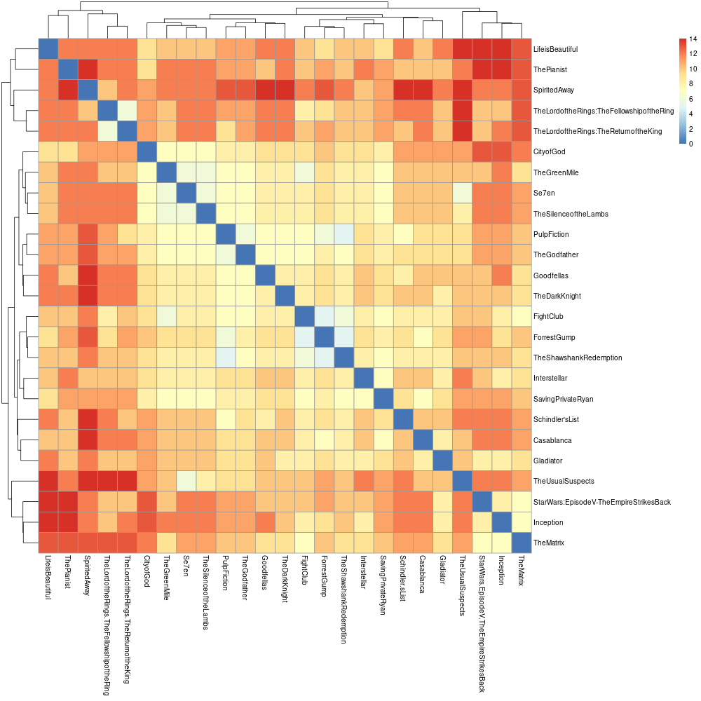
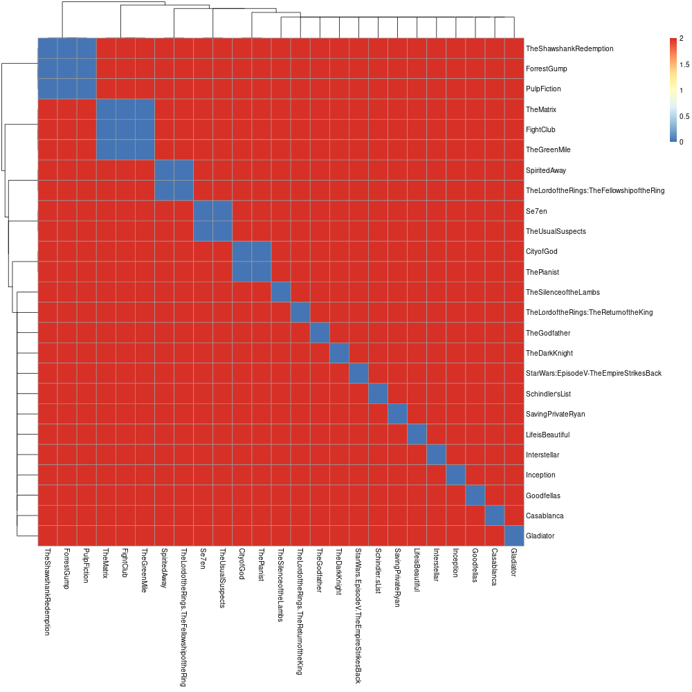

!!! Tip "Google Colab version"
    We created a [Google Colab version](https://colab.research.google.com/drive/1n3Etu4fnwuDWNveSMb1SzuN50O2a05Rg#scrollTo=8tbJ0f5-hJAB) of the tutorial. Users can view notebooks shared publicly without sign-in, but you need a google account to execute code.

    We also have a local copy of the notebook that can be downloaded from the [repo](https://github.com/CNAG-Biomedical-Informatics/pheno-ranker/blob/main/nb/convert_pheno_cli_tutorial.ipynb). 

This page provides brief tutorials on how to perform data conversion by using `Pheno-Ranker`**command-line interface**.

!!! Info "Note on installation"
    Before proceeding, ensure that the software is properly installed. In the following instructions, it will be assumed that you have downloaded and installed the [containerized version](https://github.com/CNAG-Biomedical-Informatics/pheno-ranker#containerized-recommended-method).

### Moviepackets:

For the tutorial we will use the format **Moviepackets** to demonstrate the power of `Pheno-Ranker` with any JSON file.

!!! Question "What is a Moviepacket (MXF) file?"
    A Moviepacket is an invented format :smile: designed to describe movies, analogous to Phenopackets v2 used for pheno-clinical data.


=== "Intra-catalog comparison"

    Imagine you have a catalog of 25 movies described in JSON format. Each movie has several `properties` (a.k.a. `terms`).

    ```bash
    [
      {
        "title": "TheShawshankRedemption",
        "genre": [
          "Drama"
        ],
        "year": 1994,
        "country": "USA",
        "rating": 9.3
      },
      {
        "title": "TheGodfather",
        "genre": [
          "Crime",
          "Drama"
        ],
        "year": 1972,
        "country": "USA",
        "rating": 9.2
      },...
    ]
    ```

    You are interested in checking the variety of your catalog and plan to use `Pheno-Ranker`. The first thing that we are going to create is a configuration file.

    !!! Question "What is a `Pheno-Ranker` configuration file?"
        A configuration file is a text file in [YAML](https://en.wikipedia.org/wiki/YAML) format ([JSON](https://en.wikipedia.org/wiki/JSON) is also accepted) that serves to initialize some variables. It is particularly important when you are not using the two supported formats _out-of-the-box` that are [BFF](bff.md) and [PXF](pxf.md).

    ### Creating a configuration file

    To create a configuration file, start by reviewing the [example file](https://github.com/cnag-biomedical-informatics/pheno-ranker/blob/main/t/movie_config.yaml) provided with the installation. The goal is to replace the contents of such file with those from your project. If your movies did not have array-based properties the configuration file will look like this:

    ```bash
    # Set the format
    format: MXF # Optional when no array-based properties

    # Set the primary key for the objects
    primary_key: title

    # Set the allowed terms / properties
    allowed_terms: [country,genre,year]
    ```

    But because your data has the term `genre`, which is an `array` the file will look like this:
    
    ```bash
    # Set the format
    format: MXF
    
    # Set the primary key for the objects
    primary_key: title
    
    # Set the allowed terms / properties
    allowed_terms: [country,genre,year]
    
    # Set the terms which are arrays
    array_terms: [genre]
    
    # Set the regex to perform the substitution in array elements
    array_regex: '^(\w+):(\d+)'

    # Set the path for array properties
    id_correspondence:
      MXF:
        genre: genre
    ```

    In the table below we show which parameters are needed depending on the format:

    | Format      | Required properties | Optional properties | Pre-configured |
    | ----------- | ------------------- | ------------------- |  -----  | 
    | BFF / PXF   | `primary_key, allowed_terms, array_terms, array_regex, id_correspondence` | `format` | ✓ |
    | Others (`array`) | `format, primary_key, allowed_terms, array_terms, id_correspondence` | `array_regex` |   |
    | Others (`non-array`) |  `primary_key, allowed_terms` | `format` |   |


     * Where:
        - **format**, is a `string` that defines your particular format. In this case `MXF`. Note that it has to match that of `id_correspondence`.
        - **primary_key**, the key that will be used as an item identifier.
        - **allowed_terms**, is an `array` to define the terms that can be used with the flags `--include-terms` and `--exclude-terms`.
        - **array_terms**, is an `array` to enumerate which properties are arrays.
        - **array_regex**, it's an `string` to define how the flattened JSON array elements will be renamed.
        - **id_correspondence**, is a nested `object` that maps the actual JSON path to a given array element.

    !!! Tip "Do I need to create a configuration file?"
        This file only has to be created if you are working with **your own JSON format**. 

        If your format is similar to that to Moviepackets just use that file, making sure you change the `allowed_terms` to match yours.

    ### Running `Pheno-Ranker`

    Once you have created the mapping file you can proceed to run `pheno-ranker` with the **command-line interface**. 

    #### Example 1: Let's start by using all terms

    `bin/pheno-ranker -r t/movies.json --config t/movies_config.yaml`

    The result is a file named `matrix.txt`. Find below the result of the clustering with `R`.

    <figure markdown>
      { width="600" }
      <figcaption> Intra-cohort pairwise comparison</figcaption>
    </figure>

    #### Example 2: Let's cluster by year

    `bin/pheno-ranker -r t/movies.json --include-terms year --config t/movies_config.yaml`

    <figure markdown>
      { width="600" }
      <figcaption> Intra-cohort pairwise comparison</figcaption>
    </figure>

    #### Example 3: Let's cluster by `genre`

    `bin/pheno-ranker -r t/movies.json --include-terms genre --config t/movies_config.yaml`

    <figure markdown>
       { width="600" }
       <figcaption> Intra-cohort pairwise comparison</figcaption>
    </figure>

    #### Example 4: Let's apply weights to `genre`

    We will use the file `t/movies_weigths.yaml` that has the following content:

    ```yaml
    ---
    genre.Biography: 25
    ```

    `bin/pheno-ranker -r t/movies.json --include-terms genre --w t/movies_weigths.yaml --config t/movies_config.yaml`

    <figure markdown>
      { width="600" }
      <figcaption> Intra-cohort pairwise comparison</figcaption>
    </figure>
 
=== "Movie recommendations"

    This section provides a summary of the steps to convert an OMOP-CDM export to Beacon v2 Models. The starting point is either a PostgreSQL export in the form of `.sql` or `.csv` files. The process is the same for both.

    Two possibilities may arise:

    1. **Full** export of records.
    2. **Partial** export of records.

    #### Full export 

    In a full export, all ontologies are included in the `CONCEPT` table, thus Pheno-Ranker does not need to search any additional databases for ontologies (with a few exceptions). 

    #### Partial export

    In a partial export, many ontologies may be missing from the `CONCEPT` table, as a result, `Pheno-Ranker` will perform a search on the included **ATHENA-OHDSI** database. To enable this search you should use the flag `--ohdsi-db`.

    ### Running `Pheno-Ranker`

    Once you have created the mapping file you can proceed to run `pheno-ranker` with the **command-line interface**. Please see how [here](omop-cdm.md#omop-as-input).


=== "Inter-catalog comparison"


=== "Timings"

    Expected times and memory:

    | Rows  |Cohort |      | Patient|      | 
    | ---   |------ |----- | ----   | ---  |
    |Number | Time  | RAM  | Time  | RAM  |
    | 100   | 0.5s  | <1GB | <0.5s | <1GB |
    | 1K    | 1s    | <1GB | <0.5s | <1GB |
    | 5K    | 15s   | 2GB  | <0.5s | <1GB |
    | 10K   | 1m30s | 5GB  | <1s   | <1GB |
    | 50K   |  -    |  -   |  3s   | <1GB |
    | 100K  |  -    |  -   |  6s   | <1GB |
    | 1M    |  -    |  -   |  1m   | <4GB |

    1 x Intel(R) Xeon(R) W-1350P @ 4.00GHz - 32GB RAM - SSD
