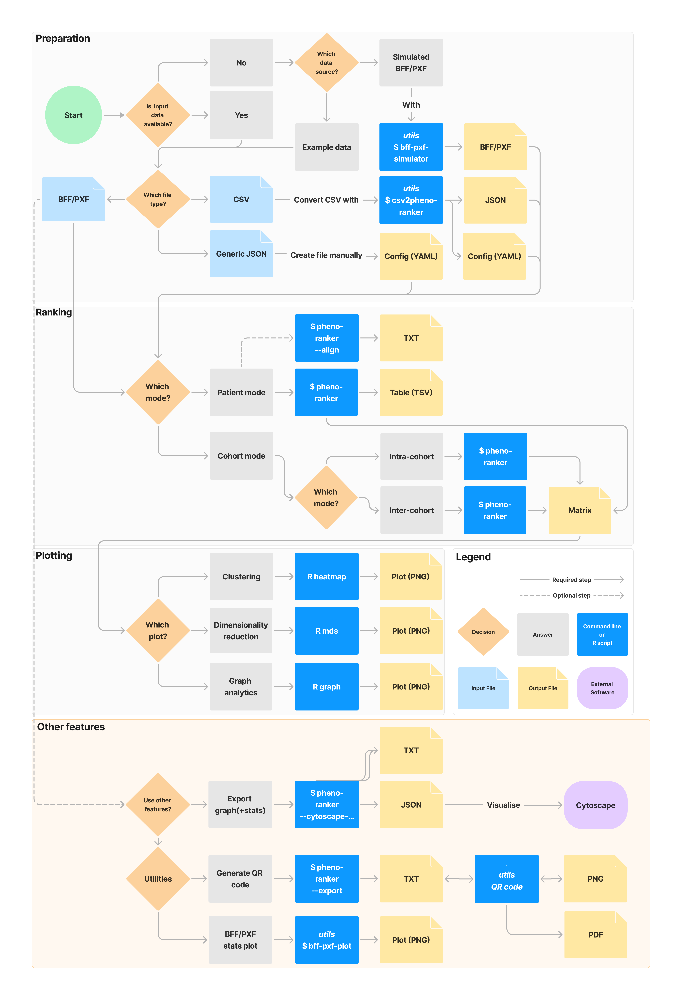

# User Workflow

The typical `Pheno-Ranker` workflow has four stages: prepare input data, run a comparison, inspect or visualize the outputs, and optionally use companion utilities.

<figure markdown>
 {width="600"}
 <figcaption>Pheno-Ranker toolkit user workflow</figcaption>
</figure>

## 1. Prepare Data

Use [BFF](bff.md) or [PXF](pxf.md) directly when your data already follows GA4GH-oriented formats. For custom `JSON` or `YAML`, provide a configuration file that defines the record identifier and comparable terms. For tabular data, use [csv2pheno-ranker](csv-import.md) to create both the `JSON` input and the configuration file.

## 2. Compare Records

Run [cohort mode](cohort.md) for all-vs-all comparisons within or across cohorts, or [patient mode](patient.md) to rank a reference cohort against a target profile. Both workflows use flattened records and one-hot encoded binary vectors.

## 3. Analyze Outputs

The main outputs are plain text files that can be inspected directly or used downstream. Cohort mode produces a pairwise matrix suitable for clustering, multidimensional scaling, or graph analytics. Patient mode produces ranked matches with Hamming distance, Jaccard similarity, Z-scores, p-values, and overlap statistics.

## 4. Use Companion Utilities

The toolkit also includes utilities to simulate BFF/PXF data, convert CSV files, plot BFF/PXF summaries, and encode Pheno-Ranker vectors as QR codes. These utilities are useful for testing installations, preparing non-GA4GH data, and building reproducible examples.
