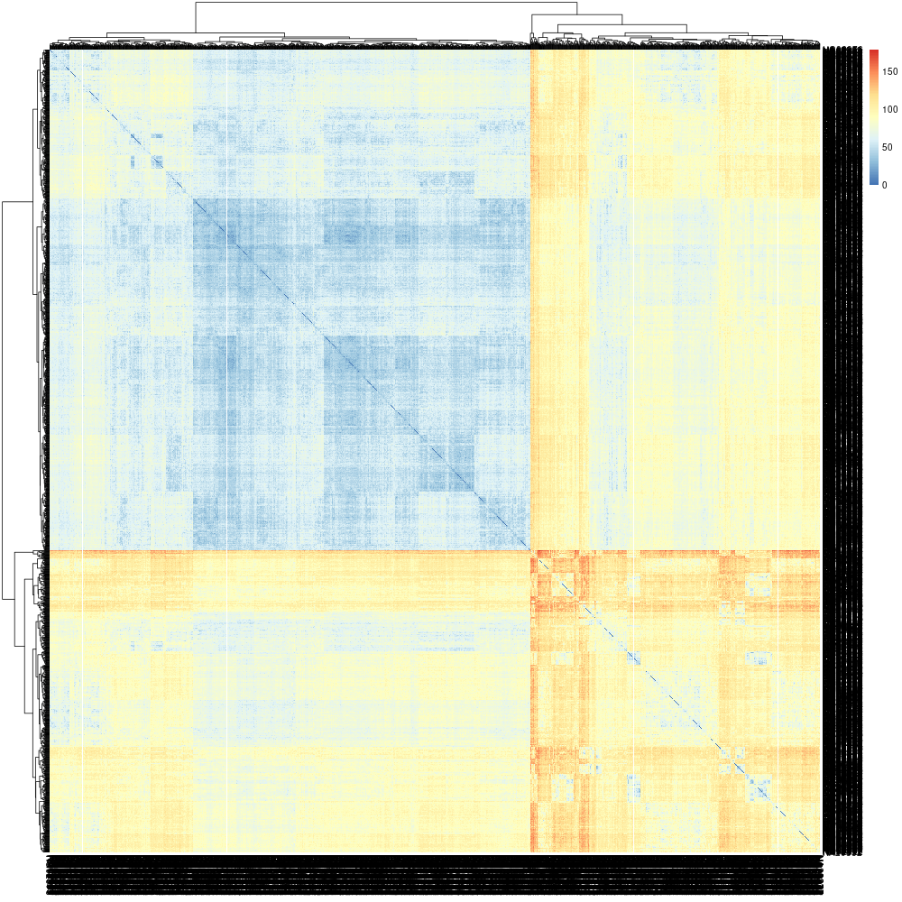
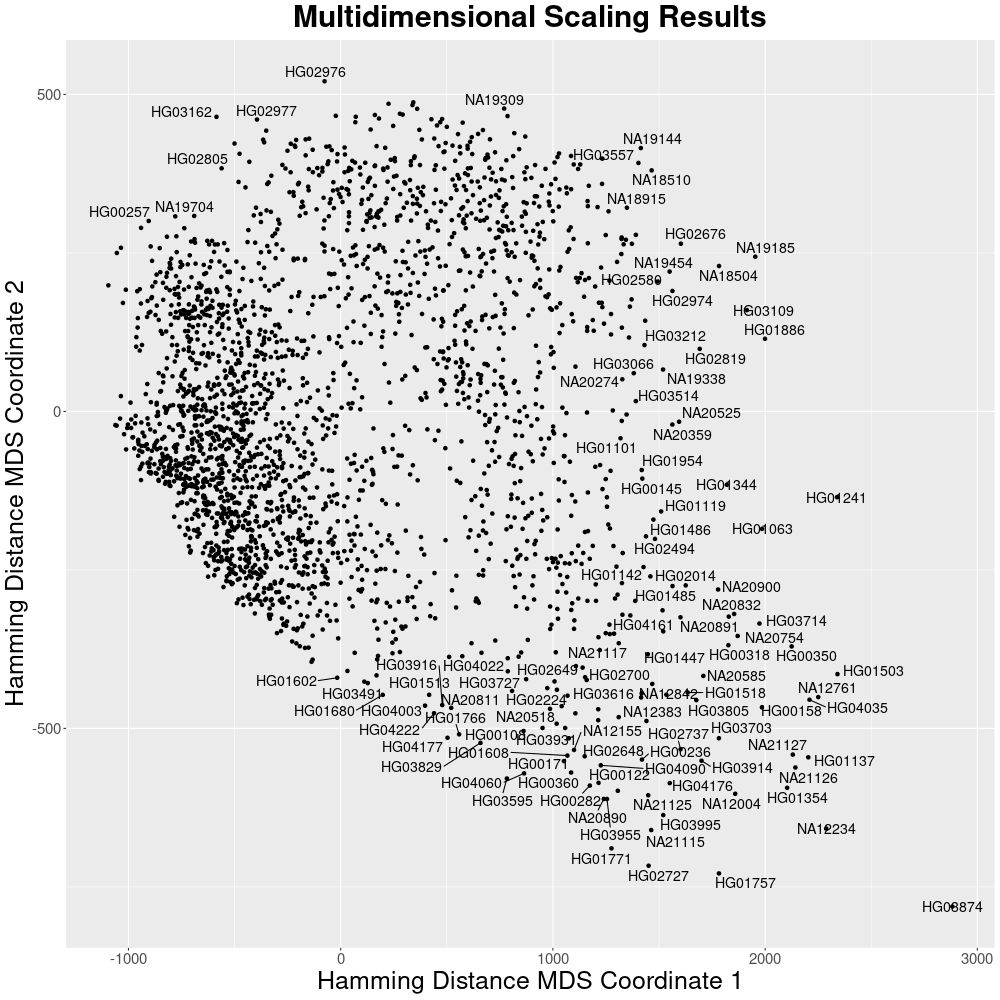
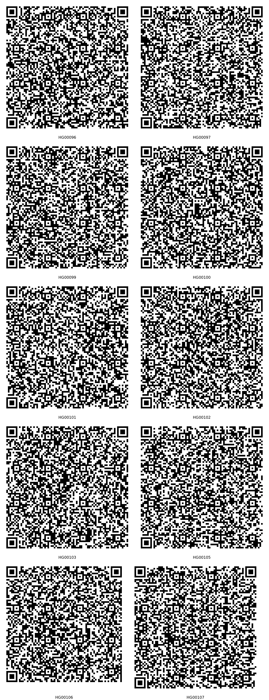

# Processing VCF files

In this page, we aim to explore the full potential of `Pheno-Ranker`. Our focus will be on processing a [VCF](https://en.wikipedia.org/wiki/Variant_Call_Format) file - a challenging yet intriguing task.

??? Tip "A VCF is essentially a specialized form of a TSV"

    The Variant Call Format (VCF) is a bioinformatics standard created for the 1000 Genomes Project to store gene variations, evolving to version 4.3 and expanded with formats like gVCF for comprehensive data representation.
 
    The body of the Variant Call Format (VCF), which is essentially a **tab-separated values (TSV) file**, comprises eight mandatory columns and an unlimited number of optional columns for additional sample information.

## Steps

OK, so our goal is to compare samples within the VCF based on their genomic variations. To achieve this, we'll undertake the following steps:

1. Transpose the VCF data into a TSV format, arranging it so that each row contains all variations for a specific sample.
2. Transform the TSV into a format that is compatible with `Pheno-Ranker`, utilizing the provided [utility](csv-import.md).
3. Execute `Pheno-Ranker` in _cohort-mode_ to generate plots using R.
4. Run `Pheno-Ranker` in _patient-mode_ to identify the most similar sample.
5. Generate QR codes for the first 10 samples (and decode them back).

??? Question "What is the source of your `VCF` test data?"

    The dataset `test_1000G.vcf.gz` is a subset extracted from the 1000 Genomes Project, containing approximately 1K variations. For more detailed information, please visit [this page](https://github.com/mrueda/beacon2-ri-tools/tree/main/test).

???+ Danger "About VCF size and content"

    The idea here is to compare samples (or individuals if you will) by their genomic variations, like if we were comparing a genomic fingerprint. A good example for this would be comparing samples in a **multi-sample** `VCF` from a **gene panel** (or even an Exome) after filtering variations.  This method of course could be complemented by adding the phenotypic information on top of the genomic variations, and then use weights. etc.

    :exclamation: We advise against using this method for comparing samples with millions of genomic variations.

Let's go!

### Step1: Tranpose the VCF to TSV

We are going to be using the included [Python script](https://github.com/CNAG-Biomedical-Informatics/pheno-ranker/blob/main/utils/csv2pheno_ranker/vcf/vcf2pheno-ranker.py)

??? Question "Can the `VCF` be multi-allelic?"
    Yes, the `VCF` can me multi-allelic. This is how variant information is stored:

    ```json
    "1_15274_A_G,T" : "0|0",
    "1_15274_A_G,T" : "0|1",
    "1_15274_A_G,T" : "0|2",
    "1_15274_A_G,T" : "1|0",
    "1_15274_A_G,T" : "1|1",
    "1_15274_A_G,T" : "1|2",
    "1_15274_A_G,T" : "2|0",
    "1_15274_A_G,T" : "2|1",
    "1_15274_A_G,T" : "2|2",
    ```
    In this example, the genotypes are _phased_, but it works also with _unphased_ genotypes (e.g., `0/1`).

```bash
utils/csv2pheno_ranker/vcf/vcf2pheno-ranker.py -i test_1000G.vcf.gz -o output.tsv
```

??? Tip "Regarding paths for executables"
        Make sure to specify the correct paths for your executables. Here, we show the paths as they exist in the Github repository.

### Step 2: Transform the TSV to a compatible format

```bash
utils/csv2pheno_ranker/csv2pheno-ranker -i output.tsv -primary-key-name 'Sample ID'
```

Where the created `output.json` has the following format format:

```json
[
  {
      "1_99490_C_T" : "0|0",
      "1_99671_A_T" : "0|0",
      ...
      "1_99687_C_T" : "0|0",
      "1_99719_C_T" : "0|0",
      "Sample ID" : "HG00096"
  },
  ...
]
```

### Step 3: Execute `Pheno-Ranker` in _cohort-mode_

```bash
bin/pheno-ranker -r output.json -config output_config.yaml
```

This created the file `matrix.txt`. It's a huge matrix of 2504 x 2504 pairwise-comparisons.

=== "Heatmap and clustering"

    Now you can create a heatmap + clustering with the included script:
    
    ```bash
    Rscript share/r/heatmap.R
    ```
    
    (Running time < 2 min in Apple M2 Pro)
    
    <figure markdown>
     { width="600" }
     <figcaption>Intra-cohort pairwise comparison</figcaption>
    </figure>


=== "Dimensionality reduction"

    Or reduce the dimensionality:
    
    ```bash
    Rscript share/r/mds.R
    ```
    
    (Running time < 2 min in Apple M2 Pro)
    
    <figure markdown>
     { width="600" }
     <figcaption>MDS for intra-cohort pairwise comparison</figcaption>
    </figure>

### Step 4: Execute `Pheno-Ranker` in _patient-mode_

Initially, we will extract a single sample from the cohort, specifically the first one listed in the VCF: `HG00096`.

```bash
bin/pheno-ranker -r output.json -config output_config.yaml --patients-of-interest HG00096
```

This creates `HG00096.json`.

Now we run `Pheno-Ranker` in _patient-mode_:

```bash
bin/pheno-ranker -r output.json -t HG00096.json -config output_config.yaml 
```

??? Abstract "See results"

    --8<-- "tbl/rank_vcf.md"

Sample `HG01537` is the closest. It has a distance of 14 to `HG00096` and a _p_-value = 0.0033449.

### Step 5: Generate QR codes for the first 10 samples

We are going to compress all variant information (1042 variations) into QR-codes

* First we are going to export the needed files, excluding the primary key 'Sample ID':

```bash
bin/pheno-ranker -r output.json -config output_config.yaml -exclude-terms 'Sample ID' --export
```

* Now we use the included utility `pheno-ranker2barcode`:

```bash
utils/barcode/pheno-ranker2barcode -i export.ref_binary_hash.json
```

This has created QR codes (`PNG`) for each sample inside the directory `qr_codes`.

??? Example "See QR codes for the first 10 samples"
    <figure markdown>
     { width="600" }
     <figcaption>QR codes for 10 samples</figcaption>
    </figure>

To decode the QR codes back to `Pheno-Ranker` format:

```bash
utils/barcode/barcode2pheno-ranker -i $(ls -1 qr_codes/*png | head -10) -t export.glob_hash.json 

```
This will create the file `decoded.json`

Enjoy!

:smile:

